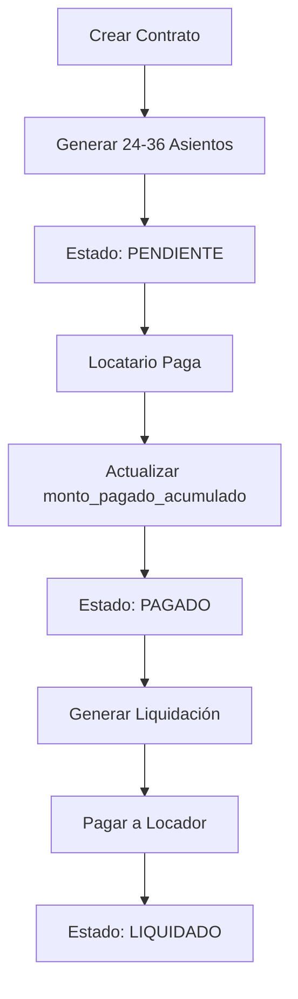

# 🏗️ ARQUITECTURA COMPLETA: Contratos → Devengamiento → Cobranza → Liquidación

## 📊 Visión General

La **solidez de la arquitectura** reside en la fuerte separación entre:

1. **Devengamiento (Módulo Contratos)**: Proyección de obligaciones
2. **Captura de Dinero (Módulo Cobranzas)**: Registro de pagos
3. **Distribución de Fondos (Módulo Liquidaciones)**: Pago a terceros

---

## 1️⃣ FASE INICIAL: Creación del Contrato y Devengamiento Proyectado

### Motor Contable Inicial

Al ejecutar `contractsService.create(CreateContractDto)`, el sistema genera **automáticamente** todos los asientos contables del contrato completo.

### Entidades Involucradas

| Entidad               | Campo Clave                           | Uso en el Asiento                                                  |
| --------------------- | ------------------------------------- | ------------------------------------------------------------------ |
| **`Contract`**        | `partes[].agente_id`                  | **Define el D/H:** Quién debe/recibe el dinero (Locador/Locatario) |
| **`Contract`**        | `terminos_financieros`                | **Define el Monto:** Monto base, comisiones, e IVA                 |
| **`Plan de Cuentas`** | `CXC_ALQ`, `CXP_LOC`, `ING_HNR`, etc. | **Define el Concepto:** La cuenta contable afectada                |
| **`AccountingEntry`** | `fecha_vencimiento`                   | **Define la Periodicidad:** Se proyecta por cada mes               |

### Generación del Asiento de Alquiler (Mensual)

Por cada mes del contrato (desde `fecha_inicio` hasta `fecha_final`), se crea un documento `AccountingEntry` con **3 partidas** que cumplen la partida doble (debe = haber).

#### Tabla de Partidas:

| Partida             | Agente       | Cuenta    | Monto                            | Campo Crítico               | Propósito                                                        |
| ------------------- | ------------ | --------- | -------------------------------- | --------------------------- | ---------------------------------------------------------------- |
| **DEBE (Activo)**   | Locatario    | `CXC_ALQ` | 100% del alquiler                | `monto_pagado_acumulado: 0` | Registra la **deuda del Locatario** hacia la Inmobiliaria        |
| **HABER (Pasivo)**  | Locador      | `CXP_LOC` | Monto Neto (Alquiler - Comisión) | -                           | Registra la **obligación de pago** de la Inmobiliaria al Locador |
| **HABER (Ingreso)** | Inmobiliaria | `ING_HNR` | Comisión (%)                     | -                           | Registra el **derecho** de la Inmobiliaria sobre su comisión     |

#### Fórmula del Split:

```typescript
const comisionPorcentaje =
  contract.terminos_financieros.comision_administracion_porcentaje / 100;

const montoTotal = contract.terminos_financieros.monto_base_vigente;
const comision = montoTotal * comisionPorcentaje;
const netoLocador = montoTotal - comision;
```

**Ejemplo con $100,000 y comisión del 7%:**

| Partida                       | Monto                  |
| ----------------------------- | ---------------------- |
| DEBE: CXC_ALQ (Locatario)     | $100,000.00            |
| HABER: CXP_LOC (Locador)      | $93,000.00             |
| HABER: ING_HNR (Inmobiliaria) | $7,000.00              |
| **Balance**                   | $100,000 = $100,000 ✅ |

### Generación del Depósito en Garantía (Único)

Se genera un asiento independiente para el depósito:

| Partida            | Agente    | Cuenta                            | Monto            | Propósito                                         |
| ------------------ | --------- | --------------------------------- | ---------------- | ------------------------------------------------- |
| **DEBE (Activo)**  | Locatario | `ACT_FID` (Caja/Banco Fiduciario) | `deposito_monto` | Registra el **derecho** de recibir el depósito    |
| **HABER (Pasivo)** | Locatario | `PAS_DEP` (Pasivo - Depósitos)    | `deposito_monto` | Registra la **obligación** de devolverlo al final |

---

## 2️⃣ FASE OPERACIONAL: Cobranzas

### ¿Qué sucede cuando el Locatario paga?

Cuando ingresa dinero, el sistema actualiza la partida de **DEBE** (la deuda).

#### Proceso:

1. **Identificación**: El operador selecciona el asiento de débito del Locatario (partida `CXC_ALQ`)
2. **Registro de Pago**: Se crea una transacción en `TransactionsModule`
3. **Actualización Contable**: El `TransactionsService`:
   - ✅ Incrementa `monto_pagado_acumulado` en la partida `CXC_ALQ`
   - ✅ Actualiza `estado` del asiento a `'PAGADO'` o `'PAGADO_PARCIAL'`

#### El campo `monto_pagado_acumulado` es la clave:

Este campo **SOLO existe en partidas de DÉBITO** y registra:

- ✅ La **plata física** que ingresó
- ✅ Cuánto del monto original ya fue cobrado
- ✅ Habilita la liquidación posterior

**Ejemplo:**

```typescript
// Asiento original (devengado)
{
  partidas: [
    {
      cuenta_id: CXC_ALQ,
      debe: 100000.00,
      haber: 0,
      agente_id: locatario_id,
      monto_pagado_acumulado: 0  // ← Sin cobrar aún
    },
    { cuenta_id: CXP_LOC, haber: 93000.00 },  // Pendiente
    { cuenta_id: ING_HNR, haber: 7000.00 }    // Pendiente
  ],
  estado: 'PENDIENTE'
}

// Después del pago del Locatario
{
  partidas: [
    {
      cuenta_id: CXC_ALQ,
      debe: 100000.00,
      haber: 0,
      agente_id: locatario_id,
      monto_pagado_acumulado: 100000.00  // ← ¡Cobrado!
    },
    { cuenta_id: CXP_LOC, haber: 93000.00 },  // Aún pendiente
    { cuenta_id: ING_HNR, haber: 7000.00 }    // Aún pendiente
  ],
  estado: 'PAGADO'
}
```

**Las partidas de HABER (`CXP_LOC`, `ING_HNR`) permanecen `'PENDIENTE'` hasta la liquidación.**

---

## 3️⃣ FASE OPERACIONAL: Liquidaciones

### ¿Qué es la Liquidación?

La liquidación es el proceso de **pagar las obligaciones** (partidas de HABER) que ya fueron cubiertas por el pago del Locatario.

#### Proceso:

1. **Llamada al Servicio**:

   ```typescript
   liquidationsService.generateLiquidation(locador_id);
   ```

2. **Identificación de Créditos Cobrados**: El servicio busca todos los asientos `CXP_LOC` e `ING_HNR` donde:

   ```typescript
   partida_CXC_ALQ.monto_pagado_acumulado >= partida_CXP_LOC.haber;
   ```

3. **Generación de Pago**:
   - Se crea orden de pago/transferencia al Locador
   - Se utiliza `agentes.cuentas_bancarias` para el destino

4. **Cierre Contable**:
   - Se actualiza `estado` de las partidas `CXP_LOC` e `ING_HNR` a **`'LIQUIDADO'`**
   - El Locador ve su cuenta corriente saldada

### Ejemplo Completo del Ciclo:

```typescript
// Estado 1: DEVENGADO (al crear el contrato)
{
  partidas: [
    { CXC_ALQ: debe: 100k, monto_pagado_acumulado: 0 },
    { CXP_LOC: haber: 93k, estado: 'PENDIENTE' },
    { ING_HNR: haber: 7k, estado: 'PENDIENTE' }
  ]
}

// Estado 2: COBRADO (cuando paga el Locatario)
{
  partidas: [
    { CXC_ALQ: debe: 100k, monto_pagado_acumulado: 100k },
    { CXP_LOC: haber: 93k, estado: 'PENDIENTE' },  // Aún no liquidado
    { ING_HNR: haber: 7k, estado: 'PENDIENTE' }   // Aún no liquidado
  ]
}

// Estado 3: LIQUIDADO (después de pagar al Locador)
{
  partidas: [
    { CXC_ALQ: debe: 100k, monto_pagado_acumulado: 100k },
    { CXP_LOC: haber: 93k, estado: 'LIQUIDADO' },  // ✅ Pagado
    { ING_HNR: haber: 7k, estado: 'LIQUIDADO' }   // ✅ Pagado
  ]
}
```

---

## 🎯 Principio de Separación

| Módulo           | Responsabilidad                               | Cuándo Actúa                  |
| ---------------- | --------------------------------------------- | ----------------------------- |
| **Contracts**    | Proyecta obligaciones futuras (Devengamiento) | Al crear el contrato          |
| **Transactions** | Registra el dinero que entra (Cobranza)       | Cuando el Locatario paga      |
| **Liquidations** | Distribuye el dinero a terceros (Pago)        | Cuando hay fondos disponibles |

### Garantía de la Arquitectura:

✅ La inmobiliaria **solo asume la obligación de pago** (Pasivo en `CXP_LOC`)  
✅ Cuando el Locatario **cumple con su deuda** (Activo en `CXC_ALQ` con `monto_pagado_acumulado`)  
✅ El flujo de caja está **completamente trackeado** mes a mes

---

## 📋 Campos Críticos en el Schema

### AccountingEntry

```typescript
{
  contrato_id: ObjectId,           // Vincula al contrato origen
  tipo_asiento: 'Alquiler',        // Tipo de asiento
  fecha_vencimiento: Date,         // Cuándo vence el pago
  estado: 'PENDIENTE | PAGADO | LIQUIDADO',
  partidas: [
    {
      cuenta_id: ObjectId,         // Referencia al Plan de Cuentas
      agente_id: ObjectId,         // Quién debe/recibe
      debe: Number,                // Monto a cobrar
      haber: Number,               // Monto a pagar
      monto_pagado_acumulado: Number  // ✅ CAMPO CRÍTICO (solo en DEBE)
    }
  ]
}
```

### Contract

```typescript
{
  terminos_financieros: {
    monto_base_vigente: Number,
    comision_administracion_porcentaje: Number,  // ✅ Variable por contrato
    indice_tipo: 'ICL' | 'IPC' | 'FIJO'
  },
  partes: [
    { agente_id: ObjectId, rol: 'LOCADOR' | 'LOCATARIO' }
  ],
  duracion_meses: Number,          // ✅ Define cuántos asientos generar
  deposito_monto: Number
}
```

---

## 🚀 Flujo Completo de Datos



---

**Este es el sistema que implementamos. Cada parte cumple su rol sin acoplamiento innecesario.**
