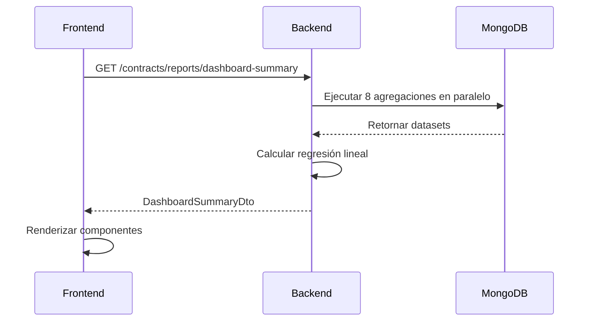
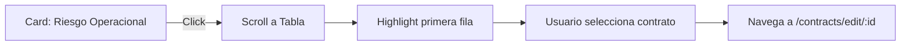

# 📊 Dashboard de Contratos - Especificación Técnica Completa

**Versión:** 1.0  
**Fecha:** Octubre 2025  
**Objetivo:** Proporcionar una vista consolidada y accionable sobre la cartera de contratos, identificando riesgos (rescisión, mora) y planificando el flujo de trabajo de ajustes y renovaciones.

---

## 🎯 Visión General

El Dashboard de Contratos es una herramienta analítica que consolida métricas operacionales y financieras del sistema de gestión de alquileres. Está diseñado para:

- **Monitoreo en tiempo real** del estado de la cartera de contratos
- **Identificación proactiva** de riesgos operacionales (vencimientos, ajustes)
- **Análisis de tendencias** para toma de decisiones estratégicas
- **Planificación del flujo de trabajo** de renovaciones y ajustes

---

## 📍 Ubicación en la Aplicación

### Frontend

- **Ruta:** `/admin/contracts/dashboard`
- **Posición:** Primer Tab del Módulo de Contratos
- **Rol de acceso:** `admin`, `superUser`, `contabilidad`, `agente`

### Backend

- **Endpoint principal:** `GET /contracts/reports/dashboard-summary`
- **Servicio:** `ContractReportsService`
- **Controlador:** `ContractsController.getDashboardSummary()`

---

## 🔧 Especificación Backend

### Endpoint Principal

```http
GET /contracts/reports/dashboard-summary
```

**Headers:**

```
Authorization: Bearer <token>
```

**Roles permitidos:**

- `admin`
- `superUser`
- `contabilidad`
- `agente`

### Estructura de Respuesta

```typescript
{
  // I. Distribución de Estados
  statusDistribution: {
    VIGENTE: 120,
    RESCINDIDO: 15,
    FINALIZADO: 30,
    PENDIENTE: 8
  },

  // II. Vencimientos Próximos (90 días)
  dueSoonCount: 22,

  // III. Promedio Financiero
  avgMonthlyValue: 185500.00,

  // IV. Distribución de Agentes por Rol
  agentRoleCount: {
    LOCADOR: 80,
    LOCATARIO: 120,
    GARANTE: 45
  },

  // V. Tasa de Rescisión
  rescissionRate: 8.5,

  // VI. Distribución de Madurez
  maturityDistribution: {
    "0-12m": 10,
    "12-24m": 50,
    "24-36m": 80,
    "36+m": 33
  },

  // VII. Proyección de Facturación
  billingProjection: [
    { month: "Oct 2024", value: 1450000, isProjected: false },
    { month: "Nov 2024", value: 1485000, isProjected: false },
    // ... (12 meses históricos)
    { month: "Nov 2025", value: 1625000, isProjected: true },
    { month: "Dec 2025", value: 1650000, isProjected: true },
    { month: "Jan 2026", value: 1675000, isProjected: true }
  ],

  // VIII. Lista de Contratos con Vencimiento Próximo
  upcomingContracts: [
    {
      contractId: "507f1f77bcf86cd799439011",
      propertyName: "Departamento 2 Amb - Palermo",
      locatarioName: "Juan Pérez",
      dueDate: "2025-12-15T00:00:00.000Z",
      daysRemaining: 63,
      actionType: "AJUSTE",
      currentAmount: 185000
    },
    // ... (hasta 50 contratos más urgentes)
  ],

  // Metadatos
  metadata: {
    generatedAt: "2025-10-13T14:30:00.000Z",
    totalContracts: 173,
    activeContracts: 120
  }
}
```

---

## 📊 Detalle de las Métricas

### I. Distribución de Estados

**Objetivo:** Visualizar el estado actual de la cartera completa de contratos.

**Lógica MongoDB:**

```javascript
db.contracts.aggregate([
  {
    $group: {
      _id: '$status',
      count: { $sum: 1 },
    },
  },
]);
```

**Casos de uso:**

- Identificar disponibilidad de inventario (contratos finalizados/rescindidos)
- Monitorear salud general de la cartera
- Detectar anomalías (ej: muchos contratos en PENDIENTE)

**Visualización recomendada:** Gráfico de Pastel (Pie Chart)

---

### II. Vencimientos y Ajustes Próximos

**Objetivo:** Alertar sobre contratos que requieren acción en los próximos 90 días.

**Lógica MongoDB:**

```javascript
db.contracts.countDocuments({
  status: 'VIGENTE',
  $or: [
    { fecha_final: { $lte: new Date(Date.now() + 90 * 24 * 60 * 60 * 1000) } },
    {
      ajuste_programado: {
        $lte: new Date(Date.now() + 90 * 24 * 60 * 60 * 1000),
      },
    },
  ],
});
```

**Casos de uso:**

- Planificación de renovaciones
- Preparación de ajustes de alquiler por índice (ICL/IPC)
- Gestión proactiva de cartera

**Visualización recomendada:** Card de Alerta (color naranja/rojo si > 20)

---

### III. Promedio Financiero

**Objetivo:** Calcular el valor promedio mensual de los contratos activos.

**Lógica MongoDB:**

```javascript
db.contracts.aggregate([
  { $match: { status: 'VIGENTE' } },
  {
    $group: {
      _id: null,
      avgAmount: { $avg: '$terminos_financieros.monto_base_vigente' },
    },
  },
]);
```

**Casos de uso:**

- Benchmark para nuevos contratos
- Análisis de estrategia de pricing
- Proyección de ingresos

**Visualización recomendada:** Card con formato de moneda (ARS $185.500)

---

### IV. Distribución de Agentes por Rol

**Objetivo:** Analizar la participación de agentes en la cartera activa.

**Lógica MongoDB:**

```javascript
db.contracts.aggregate([
  { $match: { status: 'VIGENTE' } },
  { $unwind: '$partes' },
  {
    $group: {
      _id: '$partes.rol',
      count: { $sum: 1 },
    },
  },
]);
```

**Casos de uso:**

- Identificar balance entre locadores y locatarios
- Campañas de CRM segmentadas
- Análisis de garantías (conteo de garantes)

**Visualización recomendada:** Tabla resumen o Card múltiple

---

### V. Tasa de Rescisión

**Objetivo:** Medir la eficiencia legal y operativa del sistema.

**Fórmula:**

```
Tasa de Rescisión = (RESCINDIDO / (RESCINDIDO + FINALIZADO)) × 100
```

**Interpretación:**

- **< 10%:** Excelente gestión
- **10-20%:** Normal
- **> 20%:** Requiere análisis de causas

**Casos de uso:**

- KPI de calidad de gestión
- Análisis de riesgos legales
- Evaluación de políticas de selección de locatarios

**Visualización recomendada:** Card con porcentaje y color dinámico (verde/amarillo/rojo)

---

### VI. Distribución de Madurez (Maturity)

**Objetivo:** Visualizar la antigüedad de los contratos para planificar renovaciones a largo plazo.

**Lógica MongoDB:**

```javascript
db.contracts.aggregate([
  { $match: { status: 'VIGENTE' } },
  {
    $addFields: {
      duracion_meses: {
        $divide: [
          { $subtract: ['$fecha_final', '$fecha_inicio'] },
          1000 * 60 * 60 * 24 * 30,
        ],
      },
    },
  },
  {
    $bucket: {
      groupBy: '$duracion_meses',
      boundaries: [0, 12, 24, 36, 1000],
      default: '36+m',
      output: { count: { $sum: 1 } },
    },
  },
]);
```

**Rangos:**

- **0-12m:** Contratos nuevos o de corto plazo
- **12-24m:** Contratos estándar (mayoría esperada)
- **24-36m:** Contratos largos
- **36+m:** Contratos excepcionales

**Casos de uso:**

- Identificar contratos próximos a vencer por duración
- Análisis de retención de locatarios
- Planificación de renovaciones masivas

**Visualización recomendada:** Gráfico de Barras Horizontales

---

### VII. Proyección de Facturación

**Objetivo:** Predecir ingresos futuros mediante regresión lineal sobre histórico de 12 meses.

**Algoritmo:**

1. Extraer facturación mensual de los últimos 12 meses
2. Calcular regresión lineal simple: `y = mx + b`
3. Proyectar próximos 3 meses: `valor_proyectado = último_valor + (pendiente × meses)`

**Fórmula de Regresión:**

```
pendiente (m) = (n∑xy - ∑x∑y) / (n∑x² - (∑x)²)
```

**Casos de uso:**

- Planificación financiera
- Presupuesto de ingresos
- Detección de tendencias (crecimiento/decrecimiento)

**Visualización recomendada:** Gráfico de Líneas (línea continua para histórico, intermitente para proyección)

**Nota importante:** Los meses proyectados tienen `isProjected: true` para diferenciarlos visualmente.

---

### VIII. Lista de Contratos con Vencimiento Próximo

**Objetivo:** Proporcionar una worklist accionable de contratos que requieren atención.

**Lógica:**

1. Filtrar contratos `VIGENTE` con `fecha_final` o `ajuste_programado` ≤ 90 días
2. Determinar acción requerida (VENCIMIENTO vs AJUSTE)
3. Calcular días restantes
4. Ordenar por urgencia (menor días restantes primero)
5. Limitar a 50 contratos más urgentes

**Campos retornados:**

- `contractId`: Para navegación directa
- `propertyName`: Identificación rápida
- `locatarioName`: Contacto principal
- `dueDate`: Fecha límite
- `daysRemaining`: Urgencia visual
- `actionType`: Tipo de acción requerida
- `currentAmount`: Contexto financiero

**Casos de uso:**

- Lista de tareas diarias del equipo administrativo
- Priorización de gestiones
- Navegación directa a edición de contrato

**Visualización recomendada:** Tabla con columnas ordenables y botón de acción

---

## 🎨 Especificación Frontend

### Layout General

```
┌─────────────────────────────────────────────────────────────┐
│                  Dashboard de Contratos                      │
├─────────────────────────────────────────────────────────────┤
│                                                               │
│  ┌──────────┐  ┌──────────┐  ┌──────────┐  ┌──────────┐   │
│  │ Contratos│  │  Valor   │  │  Riesgo  │  │   Tasa   │   │
│  │  Activos │  │ Promedio │  │  90 Días │  │ Rescisión│   │
│  │   120    │  │ $185.5K  │  │    22    │  │   8.5%   │   │
│  └──────────┘  └──────────┘  └──────────┘  └──────────┘   │
│                                                               │
│  ┌─────────────────────┐  ┌─────────────────────┐          │
│  │ Distribución Estados│  │ Madurez de Contratos│          │
│  │  (Gráfico Pastel)   │  │  (Gráfico de Barras)│          │
│  │                     │  │                     │          │
│  │   [Pie Chart]       │  │   [Bar Chart]       │          │
│  └─────────────────────┘  └─────────────────────┘          │
│                                                               │
│  ┌───────────────────────────────────────────────┐          │
│  │     Proyección de Facturación Mensual         │          │
│  │          (Gráfico de Líneas)                  │          │
│  │                                                │          │
│  │          [Line Chart]                          │          │
│  └───────────────────────────────────────────────┘          │
│                                                               │
│  ┌───────────────────────────────────────────────┐          │
│  │   Próximos Vencimientos y Ajustes (90 días)  │          │
│  ├─────────┬─────────┬──────┬──────┬────────────┤          │
│  │Propiedad│Locatario│Fecha │ Días │   Acción   │          │
│  ├─────────┼─────────┼──────┼──────┼────────────┤          │
│  │Dpto 2A  │J. Pérez │12/15 │  63  │ [Ajustar]  │          │
│  │Casa PH  │M. López │12/20 │  68  │ [Renovar]  │          │
│  └─────────┴─────────┴──────┴──────┴────────────┘          │
│                                                               │
└─────────────────────────────────────────────────────────────┘
```

---

## 📦 Sección 1: Tarjetas de Indicadores Clave (KPI Cards)

### Card 1: Contratos Activos

**Fuente de dato:** `statusDistribution.VIGENTE`

**Diseño:**

```
┌─────────────────────┐
│  Contratos Activos  │
│                     │
│       120           │
│       ████          │ (Color primario)
│   de 173 totales    │
└─────────────────────┘
```

**Propiedades visuales:**

- Color: Primario (azul/verde)
- Tamaño de fuente del número: 32px, bold
- Subtítulo: "de X totales" (fuente 14px)

---

### Card 2: Valor Base Promedio

**Fuente de dato:** `avgMonthlyValue`

**Diseño:**

```
┌─────────────────────┐
│  Valor Promedio     │
│                     │
│   ARS $185.500      │
│   ████████          │
│   por mes           │
└─────────────────────┘
```

**Propiedades visuales:**

- Formato: Moneda con separador de miles
- Color: Neutral
- Icono: 💰 (opcional)

---

### Card 3: Riesgo Operacional

**Fuente de dato:** `dueSoonCount`

**Diseño:**

```
┌─────────────────────┐
│ Atención Requerida  │
│   (Próximos 90d)    │
│        22           │
│   ⚠️ ████           │ (Color alerta)
│  [Ver Detalles] →   │
└─────────────────────┘
```

**Propiedades visuales:**

- Color dinámico:
  - Verde si < 10
  - Naranja si 10-20
  - Rojo si > 20
- Link a la tabla de vencimientos próximos

---

### Card 4: Tasa de Rescisión

**Fuente de dato:** `rescissionRate`

**Diseño:**

```
┌─────────────────────┐
│  Tasa de Rescisión  │
│                     │
│       8.5%          │
│   ✅ ████           │ (Verde)
│   Excelente gestión │
└─────────────────────┘
```

**Propiedades visuales:**

- Color dinámico:
  - Verde si < 10%
  - Amarillo si 10-20%
  - Rojo si > 20%
- Texto descriptivo según rango

---

## 📊 Sección 2: Gráficos de Tendencias y Distribución

### Gráfico 1: Distribución de Estados

**Tipo:** Gráfico de Pastel (Pie Chart)

**Fuente de dato:** `statusDistribution`

**Configuración:**

```javascript
{
  labels: ['VIGENTE', 'RESCINDIDO', 'FINALIZADO', 'PENDIENTE'],
  datasets: [{
    data: [120, 15, 30, 8],
    backgroundColor: ['#22c55e', '#ef4444', '#6b7280', '#f59e0b']
  }]
}
```

**Colores sugeridos:**

- VIGENTE: Verde (#22c55e)
- RESCINDIDO: Rojo (#ef4444)
- FINALIZADO: Gris (#6b7280)
- PENDIENTE: Naranja (#f59e0b)

**Interactividad:**

- Tooltip con porcentaje y cantidad absoluta
- Click para filtrar la vista principal

---

### Gráfico 2: Distribución de Madurez

**Tipo:** Gráfico de Barras Horizontales

**Fuente de dato:** `maturityDistribution`

**Configuración:**

```javascript
{
  labels: ['0-12 meses', '12-24 meses', '24-36 meses', '36+ meses'],
  datasets: [{
    label: 'Contratos',
    data: [10, 50, 80, 33],
    backgroundColor: '#3b82f6'
  }]
}
```

**Propiedades:**

- Eje X: Cantidad de contratos
- Eje Y: Rangos de duración
- Tooltip: Mostrar porcentaje del total

---

### Gráfico 3: Proyección de Facturación

**Tipo:** Gráfico de Líneas

**Fuente de dato:** `billingProjection`

**Configuración:**

```javascript
{
  labels: billingProjection.map(item => item.month),
  datasets: [{
    label: 'Facturación Mensual',
    data: billingProjection.map(item => item.value),
    borderColor: '#3b82f6',
    borderDash: (context) => {
      // Línea intermitente para proyecciones
      return context.raw.isProjected ? [5, 5] : [];
    }
  }]
}
```

**Características:**

- Línea continua para datos históricos
- Línea intermitente para proyecciones (últimos 3 meses)
- Área sombreada bajo la línea (opcional)
- Tooltip con formato de moneda

**Leyenda:**

```
─────  Histórico (12 meses)
- - -  Proyección (3 meses)
```

---

## 📋 Sección 3: Lista de Contratos con Vencimiento Próximo

**Fuente de dato:** `upcomingContracts`

### Estructura de la Tabla

| Columna        | Ancho | Ordenable | Descripción                   |
| -------------- | ----- | --------- | ----------------------------- |
| Propiedad      | 30%   | Sí        | Nombre/título de la propiedad |
| Locatario      | 20%   | Sí        | Nombre del inquilino          |
| Fecha Límite   | 15%   | Sí        | Fecha de vencimiento o ajuste |
| Días Restantes | 10%   | Sí        | Urgencia numérica             |
| Tipo           | 10%   | Sí        | VENCIMIENTO o AJUSTE          |
| Monto Actual   | 15%   | No        | Valor mensual actual          |
| Acción         | 10%   | No        | Botón de acción               |

### Diseño de Filas

**Fila normal:**

```
┌────────────┬──────────┬──────────┬──────┬────────┬─────────┬──────────┐
│ Dpto 2 Amb │ J. Pérez │ 15/12/25 │  63  │ AJUSTE │ $185.5K │ [Editar] │
│ Palermo    │          │          │      │        │         │          │
└────────────┴──────────┴──────────┴──────┴────────┴─────────┴──────────┘
```

**Fila urgente (< 30 días):**

```
┌────────────┬──────────┬──────────┬──────┬────────┬─────────┬──────────┐
│ Casa PH    │ M. López │ 20/10/25 │  7   │ VENCIM │ $220.0K │ [RENOVAR]│
│ Belgrano   │          │  ⚠️      │ 🔥   │        │         │   ⚠️     │
└────────────┴──────────┴──────────┴──────┴────────┴─────────┴──────────┘
```

### Código de Colores

| Días Restantes | Color de Fondo | Icono |
| -------------- | -------------- | ----- |
| > 60 días      | Blanco         | -     |
| 30-60 días     | Amarillo claro | ⚠️    |
| < 30 días      | Rojo claro     | 🔥    |

### Botón de Acción

**Diseño:**

```html
<button
  class="btn-action"
  @click="handleAction(contract.contractId, contract.actionType)"
>
  {{ contract.actionType === 'AJUSTE' ? 'Ajustar' : 'Renovar' }}
</button>
```

**Funcionalidad:**

- Click: Navega a `/admin/contracts/edit/:id`
- Prepopula el formulario según el tipo de acción
- Para AJUSTE: Abre modal de recálculo de índice
- Para VENCIMIENTO: Abre modal de renovación

---

## 🔄 Flujo de Interacción

### 1. Carga Inicial



**Tiempo estimado:** 200-500ms

---

### 2. Navegación desde Card de Riesgo



---

### 3. Actualización Periódica

**Estrategia de refresh:**

- **Manual:** Botón de actualización en header
- **Automático:** Cada 5 minutos (opcional)
- **Post-acción:** Después de editar un contrato

```javascript
// Ejemplo de implementación
const useDashboard = () => {
  const [data, setData] = useState(null);
  const [loading, setLoading] = useState(false);

  const refresh = async () => {
    setLoading(true);
    const response = await fetch('/contracts/reports/dashboard-summary');
    const json = await response.json();
    setData(json);
    setLoading(false);
  };

  useEffect(() => {
    refresh();
    const interval = setInterval(refresh, 5 * 60 * 1000);
    return () => clearInterval(interval);
  }, []);

  return { data, loading, refresh };
};
```

---

## 📊 Métricas de Performance

### Backend

| Métrica             | Objetivo      | Máximo Aceptable |
| ------------------- | ------------- | ---------------- |
| Tiempo de respuesta | < 300ms       | 500ms            |
| Memoria consumida   | < 100MB       | 200MB            |
| Queries MongoDB     | 8 (paralelas) | 10               |

### Frontend

| Métrica                | Objetivo | Máximo Aceptable |
| ---------------------- | -------- | ---------------- |
| First Contentful Paint | < 1s     | 2s               |
| Tiempo total de render | < 1.5s   | 3s               |
| Bundle size            | < 50KB   | 100KB            |

---

## 🔐 Seguridad y Permisos

### Matriz de Acceso

| Rol            | Ver Dashboard | Exportar Datos | Editar Contratos |
| -------------- | ------------- | -------------- | ---------------- |
| `admin`        | ✅            | ✅             | ✅               |
| `superUser`    | ✅            | ✅             | ✅               |
| `contabilidad` | ✅            | ✅             | ❌               |
| `agente`       | ✅            | ❌             | ❌               |

### Consideraciones

- Los datos financieros son sensibles: usar HTTPS
- Implementar rate limiting: máximo 60 requests/minuto
- Logs de auditoría para exportaciones de datos

---

## 🧪 Testing

### Backend - Test Cases

```typescript
describe('ContractReportsService', () => {
  it('debe retornar statusDistribution con todos los estados', async () => {
    const result = await service.getDashboardSummary();
    expect(result.statusDistribution).toHaveProperty('VIGENTE');
    expect(result.statusDistribution).toHaveProperty('RESCINDIDO');
    expect(result.statusDistribution).toHaveProperty('FINALIZADO');
    expect(result.statusDistribution).toHaveProperty('PENDIENTE');
  });

  it('debe calcular correctamente la tasa de rescisión', async () => {
    // Crear 10 contratos: 8 finalizados, 2 rescindidos
    // Tasa esperada: (2 / 10) * 100 = 20%
    const result = await service.getDashboardSummary();
    expect(result.rescissionRate).toBe(20);
  });

  it('debe generar proyección de 15 meses (12 + 3)', async () => {
    const result = await service.getDashboardSummary();
    expect(result.billingProjection).toHaveLength(15);
    expect(result.billingProjection[14].isProjected).toBe(true);
  });

  it('debe limitar upcomingContracts a 50 registros', async () => {
    const result = await service.getDashboardSummary();
    expect(result.upcomingContracts.length).toBeLessThanOrEqual(50);
  });
});
```

### Frontend - Test Cases

```typescript
describe('DashboardView', () => {
  it('debe renderizar las 4 KPI cards', () => {
    render(<DashboardView />);
    expect(screen.getByText('Contratos Activos')).toBeInTheDocument();
    expect(screen.getByText('Valor Promedio')).toBeInTheDocument();
    expect(screen.getByText('Atención Requerida')).toBeInTheDocument();
    expect(screen.getByText('Tasa de Rescisión')).toBeInTheDocument();
  });

  it('debe aplicar color de alerta si dueSoonCount > 20', () => {
    const data = { dueSoonCount: 25 };
    render(<RiskCard data={data} />);
    const card = screen.getByTestId('risk-card');
    expect(card).toHaveClass('bg-red-100');
  });

  it('debe formatear correctamente los valores monetarios', () => {
    const value = 185500;
    expect(formatCurrency(value)).toBe('ARS $185.500');
  });
});
```

---

## 📚 Ejemplos de Uso

### Ejemplo 1: Monitoreo Matutino

**Escenario:** El administrador inicia su jornada laboral.

**Flujo:**

1. Abre el dashboard (`/admin/contracts/dashboard`)
2. Revisa la card "Atención Requerida" → ve 8 contratos
3. Hace scroll a la tabla "Próximos Vencimientos"
4. Ordena por "Días Restantes" (ascendente)
5. Click en "Ajustar" del primer contrato
6. Sistema abre formulario de edición con el campo `ajuste_programado` en foco
7. Completa el ajuste y guarda

**Resultado:** Contrato actualizado, `dueSoonCount` se reduce a 7.

---

### Ejemplo 2: Análisis de Tendencias Mensual

**Escenario:** El gerente financiero prepara el reporte mensual.

**Flujo:**

1. Abre el dashboard
2. Revisa el gráfico "Proyección de Facturación"
3. Observa tendencia ascendente (pendiente positiva)
4. Exporta datos del gráfico (opcional, si está implementado)
5. Analiza la "Distribución de Madurez" → detecta que el 60% de contratos vencen en 12-24 meses
6. Planifica campaña de renovación anticipada

**Resultado:** Decisión estratégica informada por datos.

---

### Ejemplo 3: Detección de Anomalías

**Escenario:** La tasa de rescisión sube al 25%.

**Flujo:**

1. El dashboard muestra la card "Tasa de Rescisión" en rojo
2. El usuario hace drill-down (click en la card)
3. Sistema muestra lista de contratos rescindidos con motivos (si está implementado)
4. Análisis revela patrón: todos son propiedades de una zona específica
5. Se inicia investigación de problemas edilicios

**Resultado:** Detección temprana de riesgo operacional.

---

## 🚀 Roadmap de Mejoras

### Fase 1 (Actual)

- ✅ Implementación de todas las métricas básicas
- ✅ Dashboard con 3 gráficos principales
- ✅ Tabla de vencimientos próximos

### Fase 2 (Q1 2026)

- 🔲 Filtros dinámicos (por zona, tipo de propiedad, rango de precio)
- 🔲 Exportación a Excel/PDF
- 🔲 Dashboard personalizable (drag & drop de widgets)

### Fase 3 (Q2 2026)

- 🔲 Alertas automáticas por email/Slack
- 🔲 Integración con sistema de notificaciones push
- 🔲 Historial de métricas (comparación mes a mes)

### Fase 4 (Q3 2026)

- 🔲 Machine Learning para predicción de rescisiones
- 🔲 Análisis de sentimiento de locatarios (integración con CRM)
- 🔲 Dashboard móvil nativo

---

## 📞 Contacto y Soporte

**Equipo Backend:**

- Endpoint: `/contracts/reports/dashboard-summary`
- Servicio: `ContractReportsService`
- Documentación: Este archivo + código fuente comentado

**Equipo Frontend:**

- Ruta: `/admin/contracts/dashboard`
- Componente principal: `DashboardView.tsx`
- Librería de gráficos recomendada: Chart.js o Recharts

**Preguntas frecuentes:**

- ¿Cómo optimizar queries? → Usar índices en `status`, `fecha_final`, `ajuste_programado`
- ¿Caching? → Redis con TTL de 5 minutos (opcional)
- ¿Actualizaciones en tiempo real? → WebSockets (fase futura)

---

## 📄 Conclusión

Este dashboard proporciona una vista 360° de la cartera de contratos, permitiendo:

- Monitoreo proactivo de vencimientos
- Análisis de tendencias financieras
- Toma de decisiones basada en datos

La implementación prioriza **claridad**, **performance** y **accionabilidad**, asegurando que ambos equipos (Backend y Frontend) trabajen con especificaciones unificadas.

---

**Última actualización:** Octubre 2025  
**Versión:** 1.0  
**Estado:** ✅ Implementado (Backend) | 🔲 Pendiente (Frontend)
