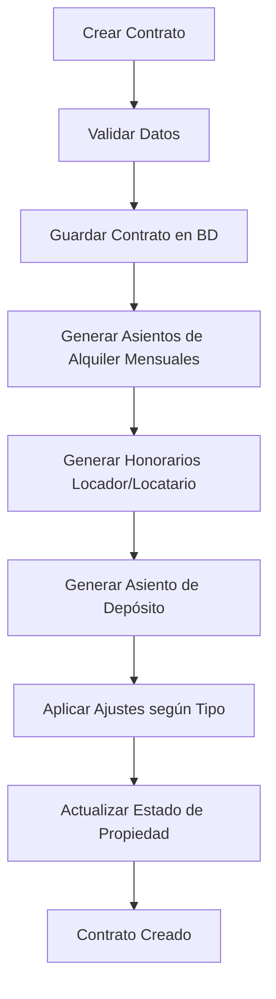

# 📋 Colección Contracts - Documentación Completa

## 📑 Índice

1. [Estado de Migración](#-estado-de-migración)
2. [Descripción General](#descripción-general)
3. [Esquema de la Entidad](#esquema-de-la-entidad)
   - [Campos Principales](#campos-principales)
   - [Subdocumentos](#subdocumentos)
   - [TerminosFinancieros Completos](#terminosfinancieros-completo)
4. [Relaciones con Otras Colecciones](#relaciones-con-otras-colecciones)
5. [Flujo de Creación de Contratos](#flujo-de-creación-de-contratos)
6. [Estados y Estadísticas](#estados-del-contrato)
7. [Ejemplo Completo](#-ejemplo-de-contrato-completo)
8. [Consideraciones Importantes](#consideraciones-importantes)
9. [Endpoints Principales](#endpoints-principales)
10. [Queries Útiles](#queries-útiles-mongodb)
11. [Próximas Mejoras](#próximas-mejoras)

---

## 🎯 Estado de Migración

| Estado                | Descripción                                                                                       |
| --------------------- | ------------------------------------------------------------------------------------------------- |
| **📊 Análisis**       | ✅ Completado                                                                                     |
| **🔧 Script**         | ✅ Completado (13/10/2025)                                                                        |
| **💾 Importación**    | ✅ Completada - 838 contratos en MongoDB                                                          |
| **📈 Salud de Datos** | 98.4% (838/852 contratos migrados)                                                                |
| **⚠️ Pendiente**      | Generación de asientos contables (~23,000 asientos)                                               |
| **📁 Documentos**     | [Resumen](./RESUMEN-MIGRACION-CONTRATOS.md) \| [Plan Completo](./MIGRACION-CONTRATOS-COMPLETA.md) |

### Resumen Ejecutivo de Migración

- **Total de contratos:** 852
- **✅ Migrados:** 838 (98.4%)
- **❌ Saltados:** 14 (1.6%) - Sin locador o locatario válido
- **⚠️ Con advertencias:** 43 (5.1%)

**Estadísticas de importación:**

- Contratos VIGENTE: 241 (28.8%)
- Contratos RESCINDIDO: 597 (71.2%)
- Tipo ICL: 629 (75.1%)
- Tipo IPC: 9 (1.1%)
- Tipo FIJO: 200 (23.8%)

**Honorarios variables:**

- Comisión 7%: 554 contratos (66%)
- Comisión 6%: 225 contratos (27%)
- Comisión 8%: 58 contratos (7%)

**Ver análisis completo:** `npm run analyze:contracts` en `/scripts`

---

## Descripción General

La colección `contracts` es el núcleo del sistema de gestión de alquileres de Propietas. Representa los **contratos de alquiler** establecidos entre locadores (propietarios) y locatarios (inquilinos) para una propiedad específica. Esta colección orquesta las relaciones entre múltiples entidades del sistema y automatiza la generación de asientos contables.

**Importante:** Los contratos contienen toda la información necesaria para generar asientos contables mensuales, pero los asientos NO se generan automáticamente durante la migración. Deben generarse en una fase posterior.

## Esquema de la Entidad

### Campos Principales

| Campo                       | Tipo                  | Descripción                                                             | Requerido |
| --------------------------- | --------------------- | ----------------------------------------------------------------------- | --------- |
| `_id`                       | `ObjectId`            | Identificador único del contrato                                        | ✅        |
| `propiedad_id`              | `ObjectId`            | Referencia a la propiedad que se alquila (ref: `Property`)              | ✅        |
| `partes`                    | `Parte[]`             | Array de participantes del contrato con sus roles                       | ✅        |
| `inventario_items`          | `ObjectId[]`          | Referencias a activos incluidos en el contrato (ref: `Asset`)           | ❌        |
| `fecha_inicio`              | `Date`                | Fecha de inicio del contrato                                            | ✅        |
| `fecha_final`               | `Date`                | Fecha de finalización del contrato (calculada automáticamente)          | ✅        |
| `duracion_meses`            | `Number`              | **Duración del contrato en meses** (ej: 24, 36)                         | ✅        |
| `fecha_recision_anticipada` | `Date`                | Fecha de rescisión anticipada (opcional)                                | ❌        |
| `status`                    | `String`              | Estado del contrato: `VIGENTE`, `FINALIZADO`, `RESCINDIDO`, `PENDIENTE` | ✅        |
| `terminos_financieros`      | `TerminosFinancieros` | **Condiciones económicas completas** (ver detalle abajo)                | ✅        |
| `deposito_monto`            | `Number`              | Monto del depósito en garantía                                          | ❌        |
| `deposito_cuotas`           | `Number`              | **En cuántas cuotas se paga el depósito** (ej: 1, 2, 3)                 | ❌        |
| `deposito_tipo_ajuste`      | `String`              | Tipo de ajuste del depósito: `AL_ORIGEN` o `AL_ULTIMO_ALQUILER`         | ❌        |
| `ajuste_programado`         | `Date`                | Fecha programada para el próximo ajuste de alquiler                     | ❌        |
| `usuario_creacion_id`       | `ObjectId`            | Usuario que creó el contrato (ref: `User`)                              | ❌        |
| `usuario_modificacion_id`   | `ObjectId`            | Último usuario que modificó el contrato (ref: `User`)                   | ❌        |
| `firmas_completas`          | `Boolean`             | **Todas las partes han firmado el contrato**                            | ✅        |
| `documentacion_completa`    | `Boolean`             | **Documentación obligatoria cargada**                                   | ✅        |
| `visita_realizada`          | `Boolean`             | **Visita a la vivienda registrada**                                     | ✅        |
| `inventario_actualizado`    | `Boolean`             | **Inventario actualizado y confirmado**                                 | ✅        |
| `fotos_inventario`          | `String[]`            | **Fotos de la vivienda adjuntas al inventario**                         | ✅        |
| `createdAt`                 | `Date`                | Fecha de creación del registro (timestamp automático)                   | ✅        |
| `updatedAt`                 | `Date`                | Fecha de última actualización (timestamp automático)                    | ✅        |

---

## 🚦 Validación de Hitos Previos a Activación (`VIGENTE`)

> **¡IMPORTANTE PARA FRONTEND Y BACKEND!**

Desde octubre 2025, el backend **no permite** cambiar el estado del contrato a `VIGENTE` hasta que se cumplan TODOS los siguientes hitos:

- `firmas_completas`: Todas las partes han firmado el contrato
- `documentacion_completa`: Documentación obligatoria cargada
- `visita_realizada`: Visita a la vivienda registrada
- `inventario_actualizado`: Inventario actualizado y confirmado
- `fotos_inventario`: Al menos una foto adjunta al inventario

**El frontend debe mostrar y controlar estos hitos antes de permitir la activación.**

Si falta alguno de estos campos, el backend responderá con error y el contrato permanecerá en estado `PENDIENTE`.

---

### Subdocumentos

#### Parte

Representa a los participantes del contrato:

```typescript
interface Parte {
  agente_id: ObjectId; // Referencia a Agent (REQUERIDO)
  rol: AgenteRoles; // LOCADOR, LOCATARIO, GARANTE, etc. (REQUERIDO)
}
```

**Roles disponibles:**

- `LOCADOR`: Propietario que alquila la propiedad (mínimo 1 requerido)
- `LOCATARIO`: Inquilino que renta la propiedad (mínimo 1 requerido)
- `GARANTE`: Persona que garantiza el contrato (opcional, puede haber varios)

**Validación:** Todo contrato DEBE tener al menos 1 LOCADOR y 1 LOCATARIO.

---

#### TerminosFinancieros (COMPLETO)

Define **todas** las condiciones económicas del contrato:

```typescript
interface TerminosFinancieros {
  // ============================================================
  // MONTO E ÍNDICE
  // ============================================================
  monto_base_vigente: number; // Monto actual del alquiler (REQUERIDO)
  indice_tipo: 'ICL' | 'IPC' | 'FIJO'; // Tipo de indexación (REQUERIDO)
  interes_mora_diaria: number; // Interés por mora en % (default: 0)
  iva_calculo_base: 'INCLUIDO' | 'MAS_IVA'; // Cálculo de IVA (default: 'MAS_IVA')

  // ============================================================
  // HONORARIOS (VARIABLES POR CONTRATO)
  // ============================================================
  comision_administracion_porcentaje: number; // % comisión mensual de la inmobiliaria
  // Valores típicos: 6%, 7%, 8%
  // Se aplica sobre cada alquiler mensual

  honorarios_locador_porcentaje: number; // % honorario que paga el propietario
  // Valores típicos: 2%, 5%
  // Se calcula sobre el total del contrato

  honorarios_locador_cuotas: number; // En cuántas cuotas se divide
  // Valores típicos: 1, 2, 3

  honorarios_locatario_porcentaje: number; // % honorario que paga el inquilino
  // Valores típicos: 2%, 5%
  // Se calcula sobre el total del contrato

  honorarios_locatario_cuotas: number; // En cuántas cuotas se divide
  // Valores típicos: 1, 2, 3

  // ============================================================
  // AJUSTES DE ALQUILER
  // ============================================================
  ajuste_porcentaje: number; // % o valor de ajuste fijo
  // Solo aplica si indice_tipo = 'FIJO'

  ajuste_periodicidad_meses: number; // Cada cuántos meses se ajusta
  // Valores típicos: 3, 6, 12

  ajuste_es_fijo: boolean; // Si el ajuste es fijo (true) o variable (false)

  indice_valor_inicial: number; // Valor del índice al crear el contrato
  // Si ICL: valor ICL (ej: 1.234)
  // Si IPC: valor IPC/RIPTE (ej: 125.6)
  // Si FIJO: 0
}
```

#### 💰 Cálculo de Honorarios

**Ejemplo de contrato:**

- Alquiler mensual: $10,000
- Duración: 24 meses
- Comisión admin: 7%
- Honorarios locador: 2% en 1 cuota
- Honorarios locatario: 5% en 2 cuotas

**Cálculos:**

1. **Comisión mensual de la inmobiliaria:**

   ```
   Por cada mes: $10,000 × 7% = $700
   Total en 24 meses: $700 × 24 = $16,800
   ```

2. **Honorarios del locador:**

   ```
   Base de cálculo: $10,000 × 24 = $240,000
   Honorario total: $240,000 × 2% = $4,800
   Por cuota: $4,800 ÷ 1 = $4,800 (paga todo junto)
   ```

3. **Honorarios del locatario:**
   ```
   Base de cálculo: $10,000 × 24 = $240,000
   Honorario total: $240,000 × 5% = $12,000
   Por cuota: $12,000 ÷ 2 = $6,000 (2 cuotas)
   ```

#### 📈 Tipos de Ajuste

| Tipo   | Descripción                                    | Periodicidad Típica | Valor Inicial |
| ------ | ---------------------------------------------- | ------------------- | ------------- |
| `ICL`  | Índice de Contratos de Locación (Argentina)    | 12 meses            | Valor ICL     |
| `IPC`  | Índice de Precios al Consumidor o RIPTE        | 12 meses            | Valor IPC     |
| `FIJO` | Sin índice, ajuste fijo por porcentaje o monto | 3, 6, 12 meses      | 0             |

## Relaciones con Otras Colecciones

### 1. **Properties (Propiedades)**

- **Tipo de relación:** Many-to-One (muchos contratos → una propiedad)
- **Campo:** `propiedad_id`
- **Descripción:** Cada contrato está asociado a una propiedad específica. Cuando se crea un contrato, la propiedad cambia su estado a `ALQUILADO` y se registra el `contrato_vigente_id`.
- **Impacto:** Al crear un contrato, se actualiza automáticamente el estado de la propiedad.

### 2. **Agents (Agentes)**

- **Tipo de relación:** Many-to-Many a través del array `partes`
- **Campo:** `partes[].agente_id`
- **Descripción:** Un contrato involucra múltiples agentes con diferentes roles:
  - **LOCADOR:** Propietario que alquila la propiedad
  - **LOCATARIO:** Inquilino que renta la propiedad
  - **GARANTE:** Persona que garantiza el contrato (opcional)
- **Uso:** Los agentes se utilizan para generar asientos contables asociados a cada parte.

### 3. **Assets (Activos de Propiedad)**

- **Tipo de relación:** Many-to-Many
- **Campo:** `inventario_items[]`
- **Descripción:** Los contratos pueden incluir un inventario de activos (muebles, electrodomésticos) que forman parte del alquiler. Esto permite un control detallado del estado de los bienes al inicio y fin del contrato.

### 4. **AccountingEntries (Asientos Contables)**

- **Tipo de relación:** One-to-Many (un contrato → muchos asientos)
- **Campo inverso:** `AccountingEntry.contrato_id`
- **Estado actual:** ⚠️ **NO GENERADOS DURANTE LA MIGRACIÓN**
- **Descripción:** Al crear un contrato en el sistema destino, se deben generar automáticamente asientos contables:
  - **Asientos de Alquiler Mensual:** Por cada mes del contrato
  - **Asientos de Honorarios:** Locador y locatario (según cuotas)
  - **Asientos de Depósito:** Registro del depósito en garantía (según cuotas)
- **Automatización:** El sistema proyecta todos los períodos de alquiler hasta `ajuste_programado` (ICL/IPC) o `fecha_final` (FIJO).

### 5. **ChartOfAccounts (Plan de Cuentas)**

- **Tipo de relación:** Uso indirecto a través de AccountingEntries
- **Descripción:** Al generar asientos contables, se utilizarán las siguientes cuentas:

  **Por cada mes de alquiler:**
  - `CXC_ALQ`: Alquiler a Cobrar (del locatario) - **DEBE 100%**
  - `CXP_LOC`: Alquiler a Pagar al Locador - **HABER (100% - comision%)**
  - `ING_HNR`: Ingreso por Honorarios - **HABER comision%** (variable: 6%, 7%, 8%)

  **Honorarios iniciales locador:**
  - `CXC_HNR_LOC`: Honorarios a Cobrar al Locador - **DEBE**
  - `ING_HNR`: Ingreso por Honorarios - **HABER**
  - Se divide en `honorarios_locador_cuotas` cuotas

  **Honorarios iniciales locatario:**
  - `CXC_HNR_TEN`: Honorarios a Cobrar al Locatario - **DEBE**
  - `ING_HNR`: Ingreso por Honorarios - **HABER**
  - Se divide en `honorarios_locatario_cuotas` cuotas

  **Depósito en garantía:**
  - `ACT_FID`: Activo Fiduciario (Caja/Banco) - **DEBE**
  - `PAS_DEP`: Pasivo por Depósito - **HABER**
  - Se divide en `deposito_cuotas` cuotas si es mayor a 1

### 6. **Users (Usuarios)**

- **Tipo de relación:** Many-to-One para auditoría
- **Campos:** `usuario_creacion_id`, `usuario_modificacion_id`
- **Descripción:** Registro de trazabilidad para saber quién creó y modificó el contrato.

## Flujo de Creación de Contratos



### Proceso Detallado

1. **Validación de datos:**
   - Verificar que exista al menos 1 LOCADOR y 1 LOCATARIO
   - Validar que `fecha_final` > `fecha_inicio`
   - Validar que `duracion_meses` sea coherente
   - Verificar que la propiedad exista y esté disponible

2. **Creación del contrato:**
   - Se guarda el documento en la base de datos
   - Status inicial: `VIGENTE` si fecha_inicio ≤ hoy, sino `PENDIENTE`

3. **Generación de asientos contables de alquiler mensual:**
   - Se proyectan los meses desde `fecha_inicio` hasta:
     - `ajuste_programado` (si es ICL o IPC)
     - `fecha_final` (si es FIJO)
   - **Por cada mes se crea un asiento con tres partidas:**
     ```
     DEBE:  CXC_ALQ = monto_base_vigente × 100%
     HABER: CXP_LOC = monto_base_vigente × (100% - comision_administracion_porcentaje)
     HABER: ING_HNR = monto_base_vigente × comision_administracion_porcentaje
     ```
   - **Ejemplo:** Alquiler $10,000, comisión 7%
     ```
     DEBE:  CXC_ALQ = $10,000 (locatario debe pagar)
     HABER: CXP_LOC = $9,300  (locador recibe 93%)
     HABER: ING_HNR = $700    (inmobiliaria cobra 7%)
     ```

4. **Generación de honorarios del locador** (si existe):
   - **Cálculo del monto total:**
     ```
     monto_total = monto_base_vigente × duracion_meses × (honorarios_locador_porcentaje / 100)
     monto_por_cuota = monto_total / honorarios_locador_cuotas
     ```
   - **Por cada cuota se crea un asiento:**
     ```
     DEBE:  CXC_HNR_LOC = monto_por_cuota
     HABER: ING_HNR = monto_por_cuota
     ```
   - **Ejemplo:** Alquiler $10,000, 24 meses, honorario 2%, 1 cuota

     ```
     monto_total = $10,000 × 24 × 2% = $4,800
     monto_por_cuota = $4,800 / 1 = $4,800

     Asiento:
     DEBE:  CXC_HNR_LOC = $4,800
     HABER: ING_HNR = $4,800
     ```

5. **Generación de honorarios del locatario** (si existe):
   - **Cálculo del monto total:**
     ```
     monto_total = monto_base_vigente × duracion_meses × (honorarios_locatario_porcentaje / 100)
     monto_por_cuota = monto_total / honorarios_locatario_cuotas
     ```
   - **Por cada cuota se crea un asiento:**
     ```
     DEBE:  CXC_HNR_TEN = monto_por_cuota
     HABER: ING_HNR = monto_por_cuota
     ```
   - **Ejemplo:** Alquiler $10,000, 24 meses, honorario 5%, 2 cuotas

     ```
     monto_total = $10,000 × 24 × 5% = $12,000
     monto_por_cuota = $12,000 / 2 = $6,000

     Asiento mes 1:
     DEBE:  CXC_HNR_TEN = $6,000
     HABER: ING_HNR = $6,000

     Asiento mes 2:
     DEBE:  CXC_HNR_TEN = $6,000
     HABER: ING_HNR = $6,000
     ```

6. **Generación de asiento de depósito:**
   - **Si `deposito_cuotas` = 1:**
     ```
     DEBE:  ACT_FID = deposito_monto
     HABER: PAS_DEP = deposito_monto
     ```
   - **Si `deposito_cuotas` > 1:**

     ```
     monto_por_cuota = deposito_monto / deposito_cuotas

     Por cada cuota:
     DEBE:  ACT_FID = monto_por_cuota
     HABER: PAS_DEP = monto_por_cuota
     ```

7. **Aplicar ajustes automáticos según tipo:**
   - **ICL:** Buscar valor ICL en la fecha de ajuste, recalcular monto
   - **IPC:** Buscar valor IPC en la fecha de ajuste, recalcular monto
   - **FIJO:** Aplicar `ajuste_porcentaje` cada `ajuste_periodicidad_meses`

8. **Actualización de la propiedad:**
   - Estado cambia a `ALQUILADO`
   - Se registra el `contrato_vigente_id`

## Estados del Contrato

| Estado       | Descripción                                  | Cantidad Migrada |
| ------------ | -------------------------------------------- | ---------------- |
| `PENDIENTE`  | Contrato creado pero no iniciado             | 0                |
| `VIGENTE`    | Contrato activo y en curso                   | 241 (28.8%)      |
| `FINALIZADO` | Contrato terminado por cumplimiento de plazo | 0                |
| `RESCINDIDO` | Contrato terminado anticipadamente           | 597 (71.2%)      |

**Total migrado:** 838 contratos

---

## 📊 Estadísticas de Datos Migrados

### Distribución por Tipo de Índice

| Tipo   | Descripción                                    | Cantidad | Porcentaje |
| ------ | ---------------------------------------------- | -------- | ---------- |
| `ICL`  | Índice de Contratos de Locación (Argentina)    | 629      | 75.1%      |
| `IPC`  | Índice de Precios al Consumidor / RIPTE        | 9        | 1.1%       |
| `FIJO` | Sin índice, ajuste fijo por porcentaje o monto | 200      | 23.8%      |

### Distribución de Comisiones de Administración

| Comisión | Cantidad | Porcentaje | Descripción                       |
| -------- | -------- | ---------- | --------------------------------- |
| **7%**   | 554      | 66.1%      | Comisión más común                |
| **6%**   | 225      | 26.8%      | Segunda más común                 |
| **8%**   | 58       | 6.9%       | Comisión premium                  |
| **0%**   | 1        | 0.1%       | Contrato sin comisión (excepción) |

**Promedio:** 6.79%

### Distribución de Honorarios

**Honorarios Locador:**

- **2%:** 661 contratos (99.7%)
- **5%:** 1 contrato
- **3%:** 1 contrato
- **Promedio:** 2.01%
- **Cuotas típicas:** 1 cuota (pago único al inicio)

**Honorarios Locatario:**

- **2%:** 663 contratos (79.7%)
- **5%:** 167 contratos (20.1%)
- **44%:** 1 contrato (caso excepcional)
- **4%:** 1 contrato
- **Promedio:** 2.66%
- **Cuotas típicas:** 1-2 cuotas

---

## 💡 Ejemplo de Contrato Completo

```json
{
  "_id": "68ed6bf0a2f299e1a0b2b31a",
  "propiedad_id": "68ed6beea2f299e1a0b2b1c7",

  "partes": [
    {
      "agente_id": "68ed6be9a2f299e1a0b2af45",
      "rol": "LOCADOR"
    },
    {
      "agente_id": "68ed6be9a2f299e1a0b2af89",
      "rol": "LOCATARIO"
    },
    {
      "agente_id": "68ed6be9a2f299e1a0b2af92",
      "rol": "GARANTE"
    }
  ],

  "fecha_inicio": "2023-01-15T00:00:00.000Z",
  "fecha_final": "2025-01-14T00:00:00.000Z",
  "duracion_meses": 24,
  "status": "VIGENTE",

  "terminos_financieros": {
    "monto_base_vigente": 10000,
    "indice_tipo": "FIJO",
    "interes_mora_diaria": 0.05,
    "iva_calculo_base": "MAS_IVA",

    "comision_administracion_porcentaje": 7,
    "honorarios_locador_porcentaje": 2,
    "honorarios_locador_cuotas": 1,
    "honorarios_locatario_porcentaje": 5,
    "honorarios_locatario_cuotas": 2,

    "ajuste_porcentaje": 12,
    "ajuste_periodicidad_meses": 6,
    "ajuste_es_fijo": false,
    "indice_valor_inicial": 0
  },

  "deposito_monto": 10000,
  "deposito_cuotas": 1,
  "deposito_tipo_ajuste": "AL_ULTIMO_ALQUILER",

  "ajuste_programado": "2023-07-15T00:00:00.000Z",

  "usuario_creacion_id": "68ed6be8a2f299e1a0b2ae12",

  "createdAt": "2023-01-10T14:30:00.000Z",
  "updatedAt": "2023-01-10T14:30:00.000Z"
}
```

### 📊 Este contrato generaría:

**1. Asientos de Alquiler Mensual** (24 asientos):

```
Cada mes:
DEBE:  CXC_ALQ = $10,000  (locatario debe pagar)
HABER: CXP_LOC = $9,300   (locador recibe 93%)
HABER: ING_HNR = $700     (inmobiliaria 7%)

Con ajustes cada 6 meses:
Mes 1-6:   $10,000/mes
Mes 7-12:  $11,200/mes (+12%)
Mes 13-18: $12,544/mes (+12%)
Mes 19-24: $14,049/mes (+12%)
```

**2. Honorarios Locador** (1 asiento):

```
Cálculo: $10,000 × 24 × 2% / 1 = $4,800

DEBE:  CXC_HNR_LOC = $4,800
HABER: ING_HNR = $4,800
```

**3. Honorarios Locatario** (2 asientos):

```
Cálculo: $10,000 × 24 × 5% / 2 = $6,000 por cuota

Mes 1:
DEBE:  CXC_HNR_TEN = $6,000
HABER: ING_HNR = $6,000

Mes 2:
DEBE:  CXC_HNR_TEN = $6,000
HABER: ING_HNR = $6,000
```

**4. Depósito en Garantía** (1 asiento):

```
DEBE:  ACT_FID = $10,000
HABER: PAS_DEP = $10,000
```

**Total de asientos para este contrato:** 28 asientos contables

## Endpoints Principales

### POST `/contracts`

Crea un nuevo contrato y genera automáticamente los asientos contables.

- **Roles permitidos:** `admin`, `superUser`
- **Body:** `CreateContractDto`

### GET `/contracts`

Lista todos los contratos con paginación.

- **Roles permitidos:** `admin`, `superUser`, `contabilidad`, `agente`
- **Query params:** Parámetros de paginación

### GET `/contracts/:id`

Obtiene un contrato específico con la propiedad poblada.

- **Roles permitidos:** `admin`, `superUser`, `contabilidad`, `agente`

### PATCH `/contracts/:id`

Actualiza un contrato existente.

- **Roles permitidos:** `admin`, `superUser`
- **Body:** `UpdateContractDto`
- **Nota:** Si se modifica `fecha_recision_anticipada`, debe cancelarse los asientos contables posteriores.

> **🟢 IMPORTANTE:**
>
> Cuando un contrato cambia de `PENDIENTE` a `VIGENTE` mediante este endpoint, el backend genera automáticamente todos los asientos contables (alquiler, honorarios, depósito) asociados a ese contrato. Esto actualiza el saldo de los agentes involucrados.
>
> Si el contrato ya estaba en `VIGENTE`, no se vuelven a generar asientos.

## Consideraciones Importantes

### Generación de Asientos Contables

El módulo de contratos está **fuertemente acoplado** con el módulo de contabilidad.

⚠️ **IMPORTANTE:** Durante la migración (13/10/2025) se importaron 838 contratos a MongoDB con **TODA la información necesaria** para generar asientos contables, pero **LOS ASIENTOS NO SE GENERARON AUTOMÁTICAMENTE**.

**Al crear un contrato en el sistema destino, se debe:**

1. **Generar asientos de alquiler mensual:**
   - Por cada mes desde `fecha_inicio` hasta `ajuste_programado` (ICL/IPC) o `fecha_final` (FIJO)
   - Comisión variable según `comision_administracion_porcentaje` (6%, 7%, 8%)

2. **Generar honorarios iniciales:**
   - Honorarios locador: divididos en `honorarios_locador_cuotas`
   - Honorarios locatario: divididos en `honorarios_locatario_cuotas`

3. **Generar depósito en garantía:**
   - Dividido en `deposito_cuotas` si es mayor a 1

4. **Aplicar ajustes automáticos:**
   - ICL: Buscar valor ICL en fecha de ajuste
   - IPC: Buscar valor IPC/RIPTE en fecha de ajuste
   - FIJO: Aplicar `ajuste_porcentaje` cada `ajuste_periodicidad_meses`

**Estimación:** Los 838 contratos migrados generarían aproximadamente **~23,000 asientos contables** históricos.

### Ajustes de Alquiler

- **ICL/IPC:** Se proyectan asientos solo hasta `ajuste_programado`, luego se debe recalcular con el nuevo valor del índice
- **FIJO:** Se proyectan hasta `fecha_final` o `fecha_recision_anticipada`
- Los ajustes se manejan mediante:
  - `ajuste_periodicidad_meses`: cada cuántos meses
  - `ajuste_porcentaje`: porcentaje de ajuste (solo FIJO)
  - `indice_valor_inicial`: valor ICL/IPC al momento de crear el contrato

### Honorarios Variables

**Cada contrato tiene sus propios porcentajes de honorarios:**

- **Comisión mensual:** 6%, 7% u 8% (variable por contrato)
- **Honorarios locador:** Típicamente 2% (algunos 3% o 5%)
- **Honorarios locatario:** Típicamente 2% o 5%

**NO usar valores fijos.** Siempre leer de `terminos_financieros`.

### Inventario de Activos

- Los activos incluidos en `inventario_items` deben existir previamente en la colección `assets`
- Esto permite un control del estado de los bienes durante el contrato
- **Estado actual:** Este campo está vacío en todos los contratos migrados

### Rescisión Anticipada

- Al establecer una `fecha_recision_anticipada`, el sistema debe:
  1. Cambiar `status` a `RESCINDIDO`
  2. Cancelar todos los asientos contables con fecha posterior
  3. Actualizar el estado de la propiedad a `DISPONIBLE`

## Dependencias del Módulo

El módulo `ContractsModule` importa:

- **AccountingEntriesModule:** Para crear asientos contables
- **ChartOfAccountsModule:** Para obtener IDs de cuentas contables
- **PropertiesModule:** Para actualizar el estado de propiedades
- **AuthModule:** Para autenticación y autorización
- **CommonModule:** Para servicios comunes como paginación

## Ejemplo de Uso (NestJS)

```typescript
// Crear un contrato con honorarios y ajustes
const createContractDto: CreateContractDto = {
  propiedad_id: '68ed6beea2f299e1a0b2b1c7',

  partes: [
    {
      agente_id: '68ed6be9a2f299e1a0b2af45',
      rol: AgenteRoles.LOCADOR,
    },
    {
      agente_id: '68ed6be9a2f299e1a0b2af89',
      rol: AgenteRoles.LOCATARIO,
    },
    {
      agente_id: '68ed6be9a2f299e1a0b2af92',
      rol: AgenteRoles.GARANTE,
    },
  ],

  fecha_inicio: new Date('2024-01-01'),
  duracion_meses: 24, // 2 años

  terminos_financieros: {
    monto_base_vigente: 150000,
    indice_tipo: 'ICL',
    interes_mora_diaria: 0.05,
    iva_calculo_base: 'MAS_IVA',

    // Honorarios (VARIABLES por contrato)
    comision_administracion_porcentaje: 7, // 7% mensual
    honorarios_locador_porcentaje: 2, // 2% sobre total
    honorarios_locador_cuotas: 1, // Pago único
    honorarios_locatario_porcentaje: 5, // 5% sobre total
    honorarios_locatario_cuotas: 2, // En 2 cuotas

    // Ajustes
    ajuste_periodicidad_meses: 12, // Anual
    indice_valor_inicial: 1.234, // Valor ICL actual
  },

  deposito_monto: 150000,
  deposito_cuotas: 1,
  deposito_tipo_ajuste: 'AL_ULTIMO_ALQUILER',

  ajuste_programado: new Date('2025-01-01'), // Próximo ajuste
};

// Crear el contrato
const contrato = await contractsService.create(createContractDto, userId);

// Esto generará automáticamente:
// - 12 asientos de alquiler (hasta ajuste_programado)
// - 1 asiento honorarios locador ($7,200)
// - 2 asientos honorarios locatario ($18,000 total, $9,000 c/u)
// - 1 asiento depósito ($150,000)
// Total: 16 asientos contables
```

## Queries Útiles (MongoDB)

```javascript
// Ver un contrato con todos los campos de honorarios
db.contracts.findOne(
  {},
  {
    duracion_meses: 1,
    'terminos_financieros.comision_administracion_porcentaje': 1,
    'terminos_financieros.honorarios_locador_porcentaje': 1,
    'terminos_financieros.honorarios_locador_cuotas': 1,
    'terminos_financieros.honorarios_locatario_porcentaje': 1,
    'terminos_financieros.honorarios_locatario_cuotas': 1,
    'terminos_financieros.ajuste_periodicidad_meses': 1,
    deposito_cuotas: 1,
  },
);

// Contar contratos por tipo de comisión
db.contracts.aggregate([
  {
    $group: {
      _id: '$terminos_financieros.comision_administracion_porcentaje',
      count: { $sum: 1 },
    },
  },
  { $sort: { count: -1 } },
]);

// Contratos vigentes con comisión mayor a 7%
db.contracts
  .find({
    status: 'VIGENTE',
    'terminos_financieros.comision_administracion_porcentaje': { $gt: 7 },
  })
  .count();

// Promedios de honorarios
db.contracts.aggregate([
  {
    $group: {
      _id: null,
      avg_comision: {
        $avg: '$terminos_financieros.comision_administracion_porcentaje',
      },
      avg_hon_locador: {
        $avg: '$terminos_financieros.honorarios_locador_porcentaje',
      },
      avg_hon_locatario: {
        $avg: '$terminos_financieros.honorarios_locatario_porcentaje',
      },
    },
  },
]);

// Contratos por tipo de ajuste y status
db.contracts.aggregate([
  {
    $group: {
      _id: {
        indice: '$terminos_financieros.indice_tipo',
        status: '$status',
      },
      count: { $sum: 1 },
    },
  },
  { $sort: { count: -1 } },
]);
```

## Próximas Mejoras

### 1. Generación de Asientos Contables (PENDIENTE)

**Estado:** Los 838 contratos están en MongoDB con toda la información, pero sin asientos contables generados.

**Tareas:**

- [ ] Crear script `generate-accounting-entries.js`
- [ ] Generar ~23,000 asientos históricos para los 838 contratos
- [ ] Implementar lógica de ajustes ICL/IPC
- [ ] Aplicar honorarios y depósitos según cuotas

### 2. Ajustes Automáticos de Alquileres

**Tarea programada que debe:**

- Detectar contratos ICL/IPC con `ajuste_programado` ≤ hoy
- Buscar valor actual del índice (ICL o IPC)
- Calcular nuevo `monto_base_vigente`
- Generar nuevos asientos hasta próximo ajuste
- Actualizar `ajuste_programado`

### 3. Validaciones en Runtime

- [ ] Validar disponibilidad de propiedad antes de crear contrato
- [ ] Prevenir contratos superpuestos en la misma propiedad
- [ ] Validar que honorarios y comisiones no superen límites razonables
- [ ] Verificar coherencia de fechas (inicio < final)

### 4. Rescisión Anticipada Completa

- [ ] Al establecer `fecha_recision_anticipada`:
  - Cambiar `status` a `RESCINDIDO`
  - Cancelar asientos posteriores a la fecha
  - Liberar propiedad (estado → `DISPONIBLE`)
  - Calcular devolución proporcional de depósito

### 5. Notificaciones Automáticas

- [ ] Alertas de vencimiento próximo (30/60/90 días)
- [ ] Notificaciones de ajuste programado
- [ ] Recordatorios de cobro de honorarios pendientes
- [ ] Avisos de mora en pagos

### 6. Reportes y Proyecciones

- [ ] Reporte de ingresos proyectados por comisiones
- [ ] Dashboard de contratos vigentes vs finalizados
- [ ] Análisis de rentabilidad por tipo de comisión
- [ ] Proyección de flujo de caja

---

## 📚 Documentación Relacionada

- **[Resumen de Migración](./RESUMEN-MIGRACION-CONTRATOS.md)** - Guía rápida de 4 pasos
- **[Migración Completa](./MIGRACION-CONTRATOS-COMPLETA.md)** - Análisis detallado de campos migrados
- **[Paso a Paso](./PASO-A-PASO-IMPORTACION.md)** - Guía completa de importación
- **[Schema TypeScript](../../schema/target/contract.entity.ts)** - Definición del schema destino
- **[Script de Migración](../../scripts/migrate-contracts.js)** - Código de migración

---

**Última actualización:** 13 de octubre de 2025, 18:30 ART  
**Versión del sistema:** 3.0  
**Contratos migrados:** 838 de 852 (98.4%)  
**Status:** ✅ Migración completada - ⏳ Asientos contables pendientes
