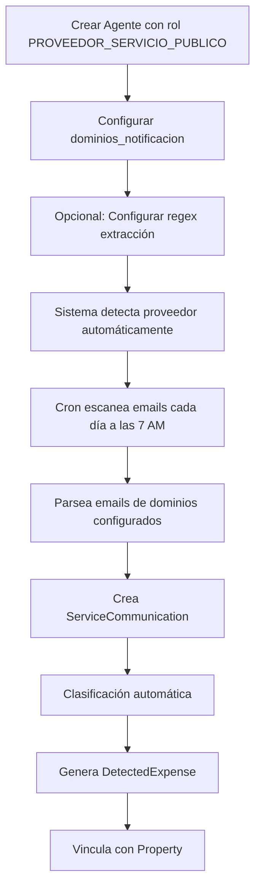

# Implementación: Rol PROVEEDOR_SERVICIO_PUBLICO

## Resumen

Se ha creado un nuevo rol de agente especializado para proveedores de servicios públicos e impuestos. Este rol permite diferenciar entre proveedores genéricos y aquellos que requieren sincronización automática de comunicaciones (facturas, avisos, etc.).

## Cambios Realizados

### 1. Enum AgenteRoles

**Archivo:** `src/modules/agents/constants/agent-roles.enum.ts`

```typescript
export enum AgenteRoles {
  // Roles de Negocio
  CLIENTE = 'CLIENTE',
  LOCADOR = 'LOCADOR',
  LOCATARIO = 'LOCATARIO',
  FIADOR = 'FIADOR',

  // Roles Operacionales
  PROVEEDOR = 'PROVEEDOR',
  PROVEEDOR_SERVICIO_PUBLICO = 'PROVEEDOR_SERVICIO_PUBLICO', // ✨ NUEVO
  INMOBILIARIA = 'INMOBILIARIA',
  COMPRADOR = 'COMPRADOR',
  VENDEDOR = 'VENDEDOR',
}
```

### 2. Documentación Actualizada

#### AGENTS_API.md

- ✅ Actualizado listado de roles con categorías
- ✅ Agregada nota explicativa sobre `PROVEEDOR_SERVICIO_PUBLICO`
- ✅ Nuevo ejemplo 4.3: Creación de Proveedor de Servicio Público (Camuzzi)
- ✅ Documentados campos específicos: `dominios_notificacion`, `servicio_id_regex`, etc.

#### SERVICE_SYNC_API.md

- ✅ Actualizada sección "Proveedores Soportados"
- ✅ Agregados requisitos para agregar nuevos proveedores
- ✅ Clarificado que funciona con cualquier agente con rol `PROVEEDOR_SERVICIO_PUBLICO`

### 3. Scripts de Seed

#### `seed-service-providers.json`

Datos predefinidos de 6 proveedores comunes:

1. **Camuzzi Gas Pampeana S.A.** - CUIT: 30657864427
2. **Cooperativa Popular de Electricidad** - CUIT: 30546520669
3. **Municipalidad de Santa Rosa** - CUIT: 30999033336
4. **EPRE (Agua)** - CUIT: 30999044447
5. **Municipalidad de General Pico** - CUIT: 30999055558
6. **ASSA** - CUIT: 30999066669

#### `seed-service-providers.sh`

Script bash automatizado para importar proveedores:

- Lectura del JSON con `jq`
- Creación masiva vía API
- Manejo de duplicados
- Mensajes coloridos de progreso

#### `README_SEED_SERVICE_PROVIDERS.md`

Documentación completa del proceso de seed:

- Instrucciones de uso
- Requisitos previos
- Estructura de datos
- Configuración de regex
- Troubleshooting

## Proveedores de Ejemplo

### Camuzzi Gas (Completo)

```json
{
  "rol": ["PROVEEDOR_SERVICIO_PUBLICO"],
  "persona_tipo": "JURIDICA",
  "nomenclador_fiscal": "RI",
  "identificador_fiscal": "30657864427",
  "nombre_razon_social": "Camuzzi Gas Pampeana S.A.",
  "email_principal": "avisos@camuzzigas.com.ar",
  "check_automatizado": true,
  "dominios_notificacion": ["avisos.camuzzigas.com.ar", "camuzzigas.com"],
  "servicio_id_regex": "Cuenta[:\\s]+(\\d+/\\d+-\\d+-\\d+-\\d+/\\d+)",
  "monto_regex": "Total\\s*:\\s*\\$\\s*([\\d,.]+)",
  "pdf_search_key": "CAMUZZI GAS PAMPEANA",
  "pdf_attachment_names": ["factura_camuzzi.pdf", "estado_cuenta_*.pdf"]
}
```

### Cooperativa Eléctrica

```json
{
  "rol": ["PROVEEDOR_SERVICIO_PUBLICO"],
  "identificador_fiscal": "30546520669",
  "nombre_razon_social": "Cooperativa Popular de Electricidad Ltda.",
  "check_automatizado": true,
  "dominios_notificacion": ["cpe.coop", "avisos.cpe.coop"],
  "servicio_id_regex": "N[úu]mero de Socio[:\\s]+(\\d+)"
}
```

### Municipalidad (Tasas)

```json
{
  "rol": ["PROVEEDOR_SERVICIO_PUBLICO"],
  "identificador_fiscal": "30999033336",
  "nombre_razon_social": "Municipalidad de Santa Rosa",
  "check_automatizado": true,
  "dominios_notificacion": ["santarosa.gov.ar", "rentas.santarosa.gov.ar"],
  "servicio_id_regex": "Partida[:\\s]+(\\d+-\\d+)"
}
```

## Uso

### 1. Importar todos los proveedores

```bash
cd /Users/lisandropradatoledo/Documents/dev/Propietas-2025/nest-backend-v3
./scripts/seed-service-providers.sh
```

### 2. Verificar proveedores creados

```bash
# Include Authorization header (roles: admin, superUser, contabilidad)
curl -H "Authorization: Bearer <TOKEN>" http://localhost:4000/api/v1/service-sync/providers | jq
```

### 3. Probar sincronización

```bash
# Include Authorization header (roles: admin, superUser, contabilidad)
curl -H "Authorization: Bearer <TOKEN>" -X POST http://localhost:4000/api/v1/service-sync/rescan | jq
```

### 4. Crear proveedor individual

```bash
curl -X POST http://localhost:4000/api/agents \
  -H "Content-Type: application/json" \
  -d '{
    "rol": ["PROVEEDOR_SERVICIO_PUBLICO"],
    "persona_tipo": "JURIDICA",
    "nomenclador_fiscal": "RI",
    "identificador_fiscal": "30111222333",
    "nombre_razon_social": "Nuevo Proveedor S.A.",
    "email_principal": "contacto@proveedor.com",
    "direccion_fiscal": {
      "calle": "Calle Principal",
      "numero": "123",
      "provincia_id": "633c5e9b1e9b7c2b6c8f2d32",
      "localidad_id": "633c5e9b1e9b7c2b6c8f2d33",
      "codigo_postal": "Q8300"
    },
    "check_automatizado": true,
    "dominios_notificacion": ["avisos.proveedor.com"]
  }'
```

## Flujo de Trabajo



## Diferencias entre Roles

| Aspecto               | `PROVEEDOR`            | `PROVEEDOR_SERVICIO_PUBLICO`   |
| --------------------- | ---------------------- | ------------------------------ |
| **Propósito**         | Proveedores generales  | Servicios públicos e impuestos |
| **Sincronización**    | No automática          | Automática vía IMAP            |
| **Campos requeridos** | Básicos                | + dominios_notificacion        |
| **Ejemplos**          | Ferretería, Pinturería | Camuzzi, CPE, Municipalidades  |
| **Uso típico**        | Gastos manuales        | Gastos detectados automáticos  |

## Validación

```bash
# 1. Compilar sin errores
pnpm run build
# ✅ Compilación exitosa

# 2. Verificar enum exportado
grep -r "PROVEEDOR_SERVICIO_PUBLICO" src/
# ✅ Encontrado en agent-roles.enum.ts

# 3. Listar proveedores
curl -H "Authorization: Bearer <TOKEN>" http://localhost:4000/api/v1/service-sync/providers | jq 'length'
# ✅ Debería mostrar proveedores configurados
```

## Próximos Pasos

### Frontend

1. Actualizar selector de roles en formulario de agentes
2. Agregar validación: si rol = `PROVEEDOR_SERVICIO_PUBLICO`, mostrar campos adicionales
3. Componente especializado para configurar regex
4. Vista previa de regex (test con texto ejemplo)

### Backend (Opcional)

1. Filtrar `/agents` por rol específico
2. Endpoint `/agents/service-providers` que retorne solo `PROVEEDOR_SERVICIO_PUBLICO`
3. Validación: si `check_automatizado = true`, requiere `dominios_notificacion`

### Testing

1. Crear tests para validar creación con nuevo rol
2. Test de filtrado por rol
3. Test de integración service-sync con múltiples proveedores

## Archivos Modificados

```
src/modules/agents/constants/agent-roles.enum.ts     (modificado)
doc/AGENTS_API.md                                     (modificado)
doc/SERVICE_SYNC_API.md                               (modificado)
scripts/seed-service-providers.json                   (nuevo)
scripts/seed-service-providers.sh                     (nuevo)
scripts/README_SEED_SERVICE_PROVIDERS.md              (nuevo)
```

## Referencias

- [AGENTS_API.md](./AGENTS_API.md) - Documentación completa de agentes
- [SERVICE_SYNC_API.md](./SERVICE_SYNC_API.md) - API de sincronización
- [agent-roles.enum.ts](../src/modules/agents/constants/agent-roles.enum.ts) - Enum de roles
