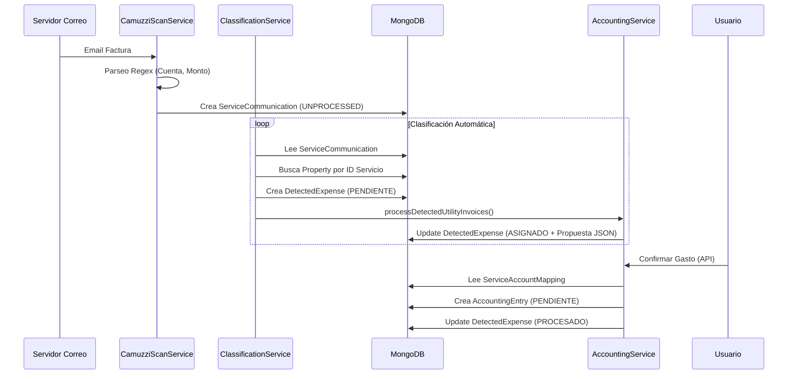

# Análisis Técnico del Flujo de Procesamiento de Servicios e Impuestos

## 1. Visión General
El módulo de **Sincronización de Servicios** (`service-sync`) se encarga de la automatización del ciclo de vida de las facturas de servicios públicos e impuestos. Su objetivo es transformar correos electrónicos no estructurados en asientos contables validados, minimizando la intervención manual.

## 2. Arquitectura del Flujo

El proceso se divide en 4 fases secuenciales:

### Fase 1: Ingesta y Digitalización (Scrapping)
*   **Responsable**: `CamuzziScanService` (`src/modules/service-sync/services/camuzzi-scan.service.ts`)
*   **Entrada**: Correos electrónicos vía IMAP.
*   **Configuración**:
    *   Credenciales IMAP en `SystemConfig`.
    *   Lista de remitentes permitidos definida en Agentes con rol `PROVEEDOR_SERVICIO_PUBLICO` (campo `dominios_notificacion`).
*   **Lógica**:
    1.  Se conecta al servidor de correo (Cron diario 7 AM o manual).
    2.  Filtra emails por remitente.
    3.  Utiliza expresiones regulares (Regex) y parsers específicos (ej. Camuzzi) para extraer:
        *   Identificador de Servicio (Nro. Cuenta, Medidor, Partida).
        *   Monto Total.
        *   Fecha de Vencimiento.
        *   Periodo de Facturación.
*   **Salida**: Crea un documento `ServiceCommunication` con estado `UNPROCESSED`.

### Fase 2: Clasificación y Vinculación
*   **Responsable**: `ClassificationService` (`src/modules/service-sync/services/classification.service.ts`)
*   **Entrada**: `ServiceCommunication` (sin procesar).
*   **Lógica**:
    1.  **Identificación**: Si el scrapper no extrajo el ID de servicio, intenta una segunda pasada heurística sobre el asunto/cuerpo.
    2.  **Normalización**: Elimina guiones, barras y puntos del ID extraído para coincidir con la BD (ej: `9103/123-4` -> `91031234`).
    3.  **Vinculación**: Busca en la colección `properties` aquellas unidades que tengan configurado el ID de servicio en su array `servicios_impuestos`.
    4.  **Tipificación**: Determina si es `FACTURA_DISPONIBLE`, `AVISO_DEUDA`, o `AVISO_CORTE` mediante análisis de palabras clave.
*   **Salida**:
    *   Crea un documento `DetectedExpense` con estado `PENDIENTE_VALIDACION`.
    *   Actualiza `ServiceCommunication` a estado `PROCESSED` y lo enlaza con el gasto detectado.

### Fase 3: Generación de Propuesta Contable
*   **Responsable**: `AccountingEntriesService` (Método `processDetectedUtilityInvoices`)
*   **Entrada**: `DetectedExpense`.
*   **Lógica**:
    1.  **Prorrateo**: Distribuye el monto del gasto entre las propiedades vinculadas.
        *   Usa `porcentaje_aplicacion` configurado en la propiedad.
        *   Si no hay porcentajes, distribuye en partes iguales.
    2.  **Construcción de Partidas**:
        *   **Partidas DEBE**: Genera una partida por cada propiedad, asignando el gasto al propietario (o locatario si corresponde).
        *   **Partida HABER**: Genera una partida por el total a pagar al proveedor del servicio.
    3.  **Persistencia Temporal**: La propuesta se guarda como un objeto JSON (`propuesta_asiento`) dentro del documento `DetectedExpense`. No se crea el asiento contable todavía.
*   **Salida**: Actualiza `DetectedExpense` a estado `ASIGNADO`.

### Fase 4: Confirmación y Contabilización
*   **Responsable**: `AccountingEntriesController` -> `AccountingEntriesService` (Método `processDetectedExpenseToEntry`)
*   **Trigger**: Acción de usuario "Confirmar Gasto" (Endpoint `POST /process-detected-expense`).
*   **Lógica**:
    1.  **Resolución de Cuentas**: Busca un `ServiceAccountMapping` activo para el proveedor. Este mapping define qué cuentas del Plan de Cuentas usar (ej. "Gastos Generales" vs "AySA").
    2.  **Validación de Contratos**: Verifica si hay contratos vigentes para asignar correctamente la deuda al locatario o al propietario (fallback).
    3.  **Creación del Asiento**: Materializa la propuesta en un documento `AccountingEntry` real.
*   **Salida**:
    *   Crea `AccountingEntry` con estado `PENDIENTE`.
    *   Actualiza `DetectedExpense` a estado `PROCESADO` y guarda referencia al asiento (`asiento_creado_id`).

## 3. Diagrama de Secuencia



## 4. Entidades y Relaciones

*   **Agent (`PROVEEDOR_SERVICIO_PUBLICO`)**: Define *quién* envía las facturas y *cómo* leerlas (Regex).
*   **Property**: Define *qué* servicio corresponde a *qué* unidad funcional (`identificador_servicio`).
*   **ServiceAccountMapping**: Puente entre el Proveedor y la Contabilidad (Plan de Cuentas).

## 5. Puntos de Extensión

Para agregar un nuevo proveedor de servicios:
1.  Crear un **Agente** con rol `PROVEEDOR_SERVICIO_PUBLICO`.
2.  Configurar `dominios_notificacion` (ej. `@edesur.com.ar`).
3.  (Opcional) Configurar `servicio_id_regex` y `monto_regex` si el formato estándar no funciona.
4.  Crear un **ServiceAccountMapping** para asignar sus cuentas contables.

## 6. Especificación de API y Datos para Frontend

Esta sección detalla cómo el Frontend debe consumir y presentar la información de los gastos detectados ("Bandeja de Entrada de Facturas").

### Endpoint de Listado (Bandeja de Entrada)
*   **URL**: `GET /api/v1/detected-expenses`
*   **Descripción**: Obtiene todos los gastos detectados por el sistema.
*   **Filtrado Recomendado**: El frontend debería filtrar localmente o solicitar backend filtering por `estado_procesamiento: 'ASIGNADO'` para mostrar solo los listos para confirmar.

#### Ejemplo de Respuesta (JSON)
```json
[
  {
    "_id": "65a1b2c3d4e5f67890123456",
    "identificador_servicio": "9103123456",
    "tipo_alerta": "FACTURA_DISPONIBLE",
    "monto_estimado": 15000.50,
    "fecha_deteccion": "2024-03-15T10:00:00.000Z",
    "estado_procesamiento": "ASIGNADO",
    "propuesta_asiento": {
      "descripcion": "Propuesta para gasto detectado 9103123456",
      "monto_original": 15000.50,
      "partidas_propuesta": [
        {
          "descripcion": "Gasto detectado FACTURA_DISPONIBLE 9103123456 - UF-101",
          "agente_id": "65a1b2c3d4e5f67890123001", 
          "monto": 7500.25,
          "porcentaje": 50,
          "suggested_account_code": "EGRESO_SERVICIOS" // Solo referencia, el sistema usa CXC_SERVICIOS
        },
        {
          "descripcion": "Gasto detectado FACTURA_DISPONIBLE 9103123456 - UF-102",
          "agente_id": "65a1b2c3d4e5f67890123002",
          "monto": 7500.25,
          "porcentaje": 50,
          "suggested_account_code": "EGRESO_SERVICIOS" // Solo referencia, el sistema usa CXC_SERVICIOS
        }
      ]
    },
    "cuerpo_email": "Estimado cliente..."
  }
]
```

### Sugerencias para la Tabla de Renderización (Frontend)

La tabla de "Facturas Detectadas" debe permitir al operador validar rápidamente la información antes de confirmar el asiento.

| Columna | Dato Fuente (`row`) | Renderizado / Lógica |
| :--- | :--- | :--- |
| **Fecha** | `fecha_deteccion` | Formato `DD/MM/YYYY HH:mm` |
| **Servicio / Cuenta** | `identificador_servicio` | Mostrar ID limpio. Tooltip con `tipo_alerta` (ej: Factura, Aviso Deuda). |
| **Monto** | `monto_estimado` | Formato moneda (`$ 15.000,50`). Resaltar si es 0 o nulo (requiere edición manual). |
| **Propiedades Afectadas** | `propuesta_asiento.partidas_propuesta` | Mostrar lista de UFs afectadas (ej: "UF-101, UF-102"). <br> *Badge* con cantidad (ej: "2 Props"). |
| **Estado** | `estado_procesamiento` | **ASIGNADO**: Verde (Listo para confirmar). <br> **PENDIENTE_VALIDACION**: Amarillo (Falta vincular propiedad). <br> **PROCESADO**: Gris (Ya contabilizado). |
| **Acciones** | `_id` | **Ver Detalle**: Abre modal con el desglose del prorrateo y el email original. <br> **Confirmar**: Dispara `POST /process-detected-expense`. <br> **Descartar**: Marca como ignorado. |

### Detalle de Acciones

1.  **Confirmar Gasto**:
    *   Endpoint: `POST /api/v1/accounting-entries/process-detected-expense`
    *   Body: `{ "detectedExpenseId": "65a1b2c3..." }`
    *   Feedback: "Asiento contable generado exitosamente".

2.  **Ver Detalle (Modal)**:
    *   Debe mostrar el desglose de la `propuesta_asiento`: Quién paga qué parte.
    *   Permitir editar los montos o cuentas si el prorrateo automático no es correcto (funcionalidad futura o avanzada).
    *   Mostrar el `cuerpo_email` para referencia visual de la factura original.
