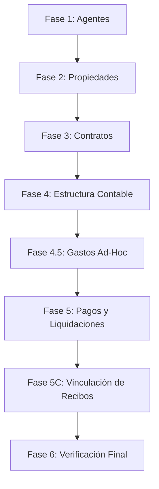
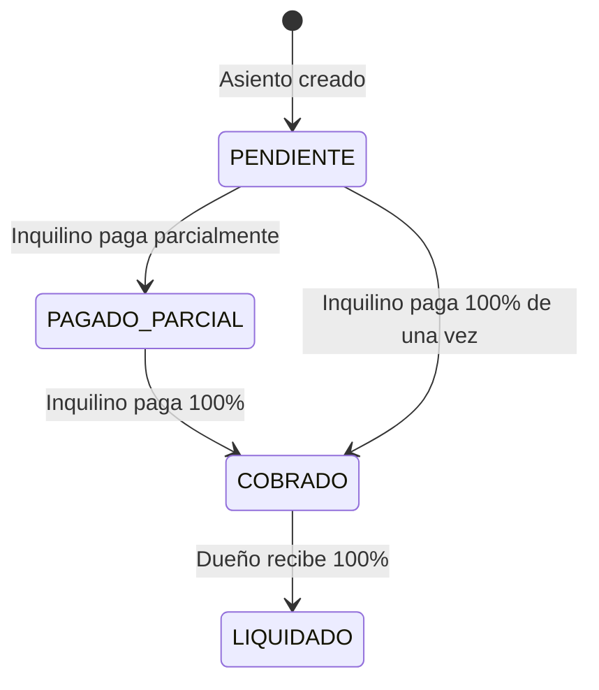

# 🚀 Guía Definitiva de Migración Legacy → V3

> **Versión:** 2.0 (Diciembre 2025)  
> **Estado:** Validado con Contrato 6902 (Modelo Quirúrgico)  
> **Autor:** Equipo Propietas

---

## 📋 Tabla de Contenidos

1. [Pre-requisitos](#pre-requisitos)
2. [Arquitectura de la Migración](#arquitectura-de-la-migración)
3. [Proceso Paso a Paso](#proceso-paso-a-paso)
4. [Lógica de Estados Contables](#lógica-de-estados-contables)
5. [Validación y Verificación](#validación-y-verificación)
6. [Troubleshooting](#troubleshooting)
7. [Rollback](#rollback)

---

## Pre-requisitos

### 1. Entorno de Trabajo

```bash
# Verificar acceso a ambas bases de datos
mongosh mongodb://127.0.0.1:27017/propietas --eval "db.stats()"
mongosh mongodb://127.0.0.1:27017/nest-propietasV3 --eval "db.stats()"

# Verificar backend V3 corriendo
curl http://localhost:3050/api/v1/health
```

### 2. Backup Obligatorio

```bash
# Crear carpeta de backup con timestamp
BACKUP_DATE=$(date +%Y%m%d_%H%M%S)
mkdir -p ./backups/$BACKUP_DATE

# Backup Legacy
mongodump --uri="mongodb://127.0.0.1:27017/propietas" \
  --out=./backups/$BACKUP_DATE/legacy

# Backup V3
mongodump --uri="mongodb://127.0.0.1:27017/nest-propietasV3" \
  --out=./backups/$BACKUP_DATE/v3

echo "✅ Backups creados en ./backups/$BACKUP_DATE"
```

### 3. Obtener Token de Autenticación

```bash
TOKEN=$(curl -s -X POST http://localhost:3050/api/v1/auth/login \
  -H "Content-Type: application/json" \
  -d '{"email":"lisan@gmail.com","password":"12345678","rememberMe":true}' \
  | jq -r '.access_token')

echo "Token: $TOKEN"
```

---

## Arquitectura de la Migración

### Orden de Ejecución (CRÍTICO)



> [!CAUTION]
> **NO saltar fases**. Cada fase depende de la anterior debido a integridad referencial de `_id`.

### Colecciones Involucradas

| Legacy | V3 | Registros Esperados |
|--------|----|--------------------|
| `agents` | `agents` | ~1,625 |
| `properties` | `properties` | ~448 |
| `leaseagreements` | `contracts` | ~862 |
| `masteraccounts` + `accounts` | `accountingentries` | ~19,322 |
| `accountentries` | `receipts` + `transactions` | ~25,913 |

---

## Proceso Paso a Paso

### FASE 1: Migración de Agentes

**Objetivo:** Migrar agentes preservando `_id` original.

**Criticidad:** 🔴 ALTA - Base de toda la pirámide de datos.

#### 1.1 Preparación

```bash
# Eliminar índice problemático en V3
mongosh mongodb://127.0.0.1:27017/nest-propietasV3 --eval "
db.agents.dropIndex('identificador_fiscal_1');
print('✅ Índice eliminado');
"
```

#### 1.2 Ejecución

```bash
cd /Users/lisandropradatoledo/Documents/dev/Propietas-2025/nest-backend-v3/migracion

npx ts-node scripts/fase-1-agentes/02-migrate-agents.ts
```

#### 1.3 Validación

```bash
mongosh mongodb://127.0.0.1:27017/nest-propietasV3 --quiet --eval "
const legacy = connect('mongodb://127.0.0.1:27017/propietas');
const v3Count = db.agents.countDocuments();
const legacyCount = legacy.agents.countDocuments();

print('Legacy:', legacyCount);
print('V3:', v3Count);
print('Match:', v3Count === legacyCount ? '✅' : '❌');
"
```

**✅ Esperado:** ~1,625 agentes migrados

---

### FASE 2: Migración de Propiedades

**Objetivo:** Migrar inventario de inmuebles vinculando a agentes.

**Dependencia:** Requiere Fase 1 completa.

#### 2.1 Ejecución

```bash
npx ts-node scripts/fase-2-propiedades/01-migrate-properties.ts
```

#### 2.2 Validación

```bash
mongosh mongodb://127.0.0.1:27017/nest-propietasV3 --quiet --eval "
print('Propiedades migradas:', db.properties.countDocuments());
print('Con warnings:', db.properties.countDocuments({_migrationNotes: {\$exists: true}}));
"
```

**✅ Esperado:** ~448 propiedades

---

### FASE 3: Migración de Contratos

**Objetivo:** Migrar contratos vigentes e históricos.

**Dependencia:** Requiere Fases 1 y 2 completas.

#### 3.1 Ejecución

```bash
npx ts-node scripts/fase-3-contratos/01-migrate-contracts.ts
```

#### 3.2 Validación

```bash
mongosh mongodb://127.0.0.1:27017/nest-propietasV3 --quiet --eval "
print('Contratos total:', db.contracts.countDocuments());
print('Vigentes:', db.contracts.countDocuments({status: 'VIGENTE'}));
print('Finalizados:', db.contracts.countDocuments({status: 'FINALIZADO'}));
"
```

**✅ Esperado:** ~862 contratos (~613 vigentes)

---

### FASE 4: Generación de Estructura Contable

**Objetivo:** Crear asientos contables mes a mes usando lógica V3.

**Dependencia:** Requiere Fase 3 completa.

> [!IMPORTANT]
> Esta fase usa la estrategia `FULL_HISTORY` que genera asientos mensuales desde `fecha_inicio` hasta hoy.

#### 4.1 Limpieza Previa (si es re-ejecución)

```bash
mongosh mongodb://127.0.0.1:27017/nest-propietasV3 --quiet --eval "
db.accountingentries.deleteMany({});
print('✅ Asientos limpiados');
"
```

#### 4.2 Ejecución

```bash
# ⚠️ PUEDE TARDAR 5-10 MINUTOS
curl -X POST http://localhost:3050/api/v1/contracts/migration/generate-accounting-entries \
  -H "Content-Type: application/json" \
  -H "Authorization: Bearer $TOKEN" \
  -d '{"strategy": "FULL_HISTORY"}' | jq '.'
```

#### 4.3 Validación

```bash
mongosh mongodb://127.0.0.1:27017/nest-propietasV3 --quiet --eval "
print('Total asientos:', db.accountingentries.countDocuments());
print('Alquileres:', db.accountingentries.countDocuments({tipo_asiento: 'Alquiler'}));
print('Depósitos:', db.accountingentries.countDocuments({tipo_asiento: 'Deposito en Garantía'}));

// Verificar balance de un asiento
const asiento = db.accountingentries.findOne({tipo_asiento: 'Alquiler'});
const debe = asiento.partidas.reduce((s,p) => s + (p.debe||0), 0);
const haber = asiento.partidas.reduce((s,p) => s + (p.haber||0), 0);
print('Balance OK:', Math.abs(debe-haber) < 0.01 ? '✅' : '❌');
"
```

**✅ Esperado:**
- Total: ~19,322 asientos
- Alquileres: ~18,120
- Depósitos: ~1,202
- Balance: Debe = Haber en todos

---

### FASE 4.5: Migración de Gastos Ad-Hoc

**Objetivo:** Migrar gastos de servicios (Camuzzi, Cooperativa, etc.) que no están en contratos.

**Dependencia:** Requiere Fase 4 completa.

> [!NOTE]
> Esta fase es **opcional** si no hay gastos ad-hoc en el sistema Legacy.

#### 4.5.1 Identificar Gastos Ad-Hoc

```bash
mongosh mongodb://127.0.0.1:27017/propietas --quiet --eval "
// Buscar cuentas de tipo 'Cargo proveedor' o 'Factura de Servicios'
const adhocAccounts = db.accounts.find({
  accountType: {\$in: ['Cargo proveedor', 'Factura de Servicios']}
}).count();

print('Cuentas ad-hoc encontradas:', adhocAccounts);
"
```

#### 4.5.2 Ejecución (Modo Quirúrgico)

**Para migración quirúrgica (un agente específico):**

```bash
# Editar scripts/fase-4.5-asientos-adhoc/03-migrate-adhoc-surgical.ts
# Ajustar las constantes:
# - RETAMOSA_ID (o el agente objetivo)
# - TARGET_CONTRACT_ID
# - SPECIFIC_ACCOUNT_IDS

npx ts-node scripts/fase-4.5-asientos-adhoc/03-migrate-adhoc-surgical.ts
```

**Para migración masiva:**

```bash
# Usar el script general (cuando esté disponible)
npx ts-node scripts/fase-4.5-asientos-adhoc/01-migrate-adhoc-entries.ts
```

#### 4.5.3 Validación

```bash
mongosh mongodb://127.0.0.1:27017/nest-propietasV3 --quiet --eval "
print('Asientos ad-hoc:', db.accountingentries.countDocuments({
  tipo_asiento: {\$in: ['Gasto Proveedor', 'Pago de Servicios']}
}));
"
```

---

### FASE 5: Migración de Pagos y Liquidaciones

**Objetivo:** Inyectar la historia financiera real (pagos de inquilinos, liquidaciones a dueños).

**Dependencia:** Requiere Fases 4 y 4.5 completas.

> [!IMPORTANT]
> **Lógica de Estados Contables**
> 
> Esta fase implementa la lógica crítica de diferenciación entre:
> - `monto_pagado_acumulado` (DEBE): Lo que pagó el inquilino
> - `monto_liquidado` (HABER): Lo que se rindió al dueño
> 
> Ver [Lógica de Estados Contables](#lógica-de-estados-contables) para detalles.

#### 5.1 Reset (si es re-ejecución)

```bash
npx ts-node scripts/fase-5-pagos/00-reset-migration.ts
```

#### 5.2 Ejecución

```bash
# Paso 1: Migrar pagos (actualiza monto_pagado_acumulado y monto_liquidado)
npx ts-node scripts/fase-5-pagos/05-migrate-payments.ts

# Paso 2: Vincular recibos (actualiza asientos_afectados)
npx ts-node scripts/fase-5-pagos/07-link-receipts-impact.ts
```

#### 5.3 Validación

```bash
mongosh mongodb://127.0.0.1:27017/nest-propietasV3 --quiet --eval "
// Verificar estados
print('Estados de asientos:');
print('  LIQUIDADO:', db.accountingentries.countDocuments({estado: 'LIQUIDADO'}));
print('  COBRADO:', db.accountingentries.countDocuments({estado: 'COBRADO'}));
print('  PAGADO_PARCIAL:', db.accountingentries.countDocuments({estado: 'PAGADO_PARCIAL'}));
print('  PENDIENTE:', db.accountingentries.countDocuments({estado: 'PENDIENTE'}));

// Verificar un asiento específico
const asiento = db.accountingentries.findOne({estado: 'LIQUIDADO'});
if (asiento) {
  const totalDebe = asiento.partidas.reduce((s,p) => s + (p.debe||0), 0);
  const totalPagado = asiento.partidas.reduce((s,p) => s + (p.monto_pagado_acumulado||0), 0);
  const totalLiquidado = asiento.partidas.reduce((s,p) => s + (p.monto_liquidado||0), 0);
  
  print('\\nEjemplo de asiento LIQUIDADO:');
  print('  Total Debe:', totalDebe);
  print('  Total Pagado:', totalPagado);
  print('  Total Liquidado:', totalLiquidado);
  print('  OK:', totalPagado >= totalDebe && totalLiquidado > 0 ? '✅' : '❌');
}
"
```

**✅ Esperado:**
- Asientos con estado correcto según pagos
- `monto_pagado_acumulado` > 0 en partidas DEBE pagadas
- `monto_liquidado` > 0 en partidas HABER liquidadas

---

### FASE 5C: Vinculación de Recibos

**Objetivo:** Migrar recibos como documentos independientes y vincularlos a asientos.

**Dependencia:** Requiere Fase 5 completa.

#### 5C.1 Ejecución

```bash
# Migrar recibos
npx ts-node scripts/fase-5-pagos/01-migrate-receipts.ts
```

#### 5C.2 Validación

```bash
mongosh mongodb://127.0.0.1:27017/nest-propietasV3 --quiet --eval "
print('Recibos migrados:', db.receipts.countDocuments());
print('Con asientos vinculados:', db.receipts.countDocuments({
  'asientos_afectados.0': {\$exists: true}
}));
"
```

**✅ Esperado:** ~25,913 recibos migrados

---

### FASE 6: Verificación Final

**Objetivo:** Validar integridad completa del sistema migrado.

#### 6.1 Ejecución

```bash
npx ts-node scripts/fase-6-verificacion/01-integrity-checks.ts
```

#### 6.2 Validación Manual

```bash
mongosh --quiet --eval "
const legacy = connect('mongodb://127.0.0.1:27017/propietas');
const v3 = connect('mongodb://127.0.0.1:27017/nest-propietasV3');

print('═══════════════════════════════════════');
print('   VALIDACIÓN FINAL');
print('═══════════════════════════════════════\\n');

const checks = {
  'Agentes': {
    legacy: legacy.agents.countDocuments(),
    v3: v3.agents.countDocuments()
  },
  'Propiedades': {
    legacy: legacy.properties.countDocuments(),
    v3: v3.properties.countDocuments()
  },
  'Contratos': {
    legacy: legacy.leaseagreements.countDocuments(),
    v3: v3.contracts.countDocuments()
  }
};

Object.keys(checks).forEach(key => {
  const c = checks[key];
  const match = c.legacy === c.v3 ? '✅' : '❌';
  print(key + ':', c.legacy, '->', c.v3, match);
});

print('\\nAsientos:', v3.accountingentries.countDocuments());
print('Recibos:', v3.receipts.countDocuments());
print('Transacciones:', v3.transactions.countDocuments());

print('\\n═══════════════════════════════════════');
"
```

---

## Lógica de Estados Contables

### Campos Críticos por Tipo de Partida

```typescript
// Partida DEBE (Inquilino debe pagar)
{
  debe: 100000,
  haber: 0,
  monto_pagado_acumulado: 50000,  // ✅ Lo que YA pagó el inquilino
  monto_liquidado: 0               // ❌ No aplica en DEBE
}

// Partida HABER (Dueño debe recibir)
{
  debe: 0,
  haber: 92000,
  monto_pagado_acumulado: 0,       // ❌ No aplica en HABER
  monto_liquidado: 46000           // ✅ Lo que YA se le rindió al dueño
}
```

### Transiciones de Estado



### Reglas de Negocio

| Estado | Condición |
|--------|-----------|
| **PENDIENTE** | `monto_pagado_acumulado == 0` y `monto_liquidado == 0` |
| **PAGADO_PARCIAL** | `0 < monto_pagado_acumulado < totalDebe` |
| **COBRADO** | `monto_pagado_acumulado >= totalDebe` PERO `monto_liquidado < totalHaberAgentes` |
| **LIQUIDADO** | `monto_pagado_acumulado >= totalDebe` Y `monto_liquidado >= totalHaberAgentes` |

> [!NOTE]
> **Documentación Completa:** Ver `/doc/CONTRACTS/09_LOGICA_PAGOS_Y_LIQUIDACION.md`

---

## Validación y Verificación

### Checklist de Validación por Fase

#### ✅ Post-Fase 1
- [ ] Total agentes Legacy = Total agentes V3
- [ ] Todos los `_id` preservados
- [ ] No hay duplicados de email

#### ✅ Post-Fase 2
- [ ] Total propiedades Legacy = Total propiedades V3
- [ ] Todas tienen `agente_id` válido
- [ ] No hay propiedades huérfanas

#### ✅ Post-Fase 3
- [ ] Total contratos Legacy = Total contratos V3
- [ ] Todos tienen `propiedad_id` y `partes` válidas
- [ ] Estados mapeados correctamente

#### ✅ Post-Fase 4
- [ ] Asientos generados para todos los contratos vigentes
- [ ] Balance Debe = Haber en todos los asientos
- [ ] Honorarios calculados correctamente

#### ✅ Post-Fase 5
- [ ] Estados de asientos reflejan pagos reales
- [ ] `monto_pagado_acumulado` correcto en DEBE
- [ ] `monto_liquidado` correcto en HABER
- [ ] No hay asientos en PENDIENTE si hay pagos

#### ✅ Post-Fase 5C
- [ ] Total recibos Legacy = Total recibos V3
- [ ] Todos los recibos tienen `asientos_afectados`
- [ ] Suma de `monto_imputado` ≤ `monto_total` del recibo

### Auditoría de Saldos (Muestra Aleatoria)

```bash
# Seleccionar 5 contratos aleatorios y comparar saldos
mongosh --quiet --eval "
const legacy = connect('mongodb://127.0.0.1:27017/propietas');
const v3 = connect('mongodb://127.0.0.1:27017/nest-propietasV3');

const contratos = v3.contracts.aggregate([{\$sample: {size: 5}}]).toArray();

contratos.forEach(c => {
  print('\\nContrato:', c._id);
  
  // Calcular saldo V3
  const asientos = v3.accountingentries.find({contrato_id: c._id}).toArray();
  const saldoV3 = asientos.reduce((sum, a) => {
    return sum + a.partidas.reduce((s, p) => {
      return s + (p.debe || 0) - (p.haber || 0);
    }, 0);
  }, 0);
  
  print('  Saldo V3:', saldoV3);
  
  // TODO: Comparar con Legacy
});
"
```

---

## Troubleshooting

### Error: "Índice único duplicado"

```bash
# Eliminar índice problemático
mongosh mongodb://127.0.0.1:27017/nest-propietasV3 --eval "
db.agents.dropIndex('identificador_fiscal_1');
"
```

### Error: "Propiedad huérfana (owner no existe)"

```bash
# Identificar propiedades huérfanas
mongosh mongodb://127.0.0.1:27017/nest-propietasV3 --eval "
const props = db.properties.find({}).toArray();
props.forEach(p => {
  const owner = db.agents.findOne({_id: p.agente_id});
  if (!owner) {
    print('Huérfana:', p._id, '- Owner:', p.agente_id);
  }
});
"
```

### Error: "Balance desbalanceado (Debe ≠ Haber)"

```bash
# Identificar asientos desbalanceados
mongosh mongodb://127.0.0.1:27017/nest-propietasV3 --eval "
const asientos = db.accountingentries.find({esta_balanceado: false}).toArray();
print('Asientos desbalanceados:', asientos.length);
asientos.forEach(a => {
  const debe = a.partidas.reduce((s,p) => s + (p.debe||0), 0);
  const haber = a.partidas.reduce((s,p) => s + (p.haber||0), 0);
  print('  ID:', a._id, 'Debe:', debe, 'Haber:', haber, 'Diff:', debe - haber);
});
"
```

---

## Rollback

### Restaurar desde Backup

```bash
# Listar backups disponibles
ls -lh ./backups/

# Restaurar V3 (ajustar fecha)
RESTORE_DATE="20251218_143000"

mongorestore \
  --uri="mongodb://127.0.0.1:27017" \
  --db=nest-propietasV3 \
  --drop \
  ./backups/$RESTORE_DATE/v3/nest-propietasV3

echo "✅ Restauración completada"
```

### Rollback Parcial (Solo una Fase)

```bash
# Ejemplo: Limpiar solo asientos contables
mongosh mongodb://127.0.0.1:27017/nest-propietasV3 --eval "
db.accountingentries.deleteMany({});
db.receipts.deleteMany({});
db.transactions.deleteMany({});
print('✅ Fase 4+ limpiada');
"
```

---

## Tiempos Estimados

| Fase | Tiempo Estimado | Complejidad |
|------|----------------|-------------|
| 1. Agentes | ~2 min | Baja |
| 2. Propiedades | ~3 min | Baja |
| 3. Contratos | ~5 min | Media |
| 4. Estructura Contable | ~8 min | Alta |
| 4.5. Gastos Ad-Hoc | ~2 min | Media |
| 5. Pagos y Liquidaciones | ~10 min | Alta |
| 5C. Recibos | ~15 min | Media |
| 6. Verificación | ~5 min | Baja |
| **TOTAL** | **~50 min** | |

---

## Referencias

- 📄 **Lógica de Liquidación:** `/doc/CONTRACTS/09_LOGICA_PAGOS_Y_LIQUIDACION.md`
- 📄 **Estado de Migración:** `/doc/CONTRACTS/02_ESTADO_ACTUAL_MIGRACION.md`
- 📄 **Changelog:** `/doc/CONTRACTS/CHANGELOG.md`
- 📁 **Scripts:** `/migracion/scripts/`
- 📁 **Validaciones:** `/migracion/validacion/`

---

## Contacto y Soporte

- **Email:** lisan@gmail.com
- **Backups:** `./backups/`
- **Logs:** `./scripts/logs/`

---

> [!CAUTION]
> **Advertencia Final**
> 
> Esta migración afecta datos financieros críticos. Asegúrese de:
> 
> 1. ✅ Tener backups completos antes de comenzar
> 2. ✅ Ejecutar en entorno de prueba primero
> 3. ✅ Validar cada fase antes de continuar
> 4. ✅ Mantener registros detallados
> 5. ✅ No ejecutar en producción sin aprobación

---

**Última actualización:** 22 de diciembre de 2025  
**Versión:** 2.0 (Validada con Contrato 6902)
