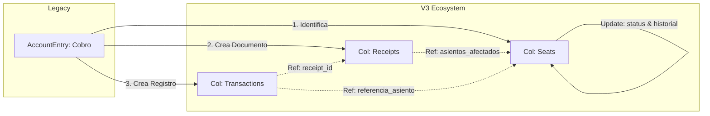

**Asunto:** Especificación Técnica Final: Estrategia de Migración Legacy -\> V3 (Seat + Transaction + Receipt)

**Referencia:** Documentación en `@../../Propietas-2025/nest-backend-v3/migracion`

### 1\. Resumen del Pipeline de Migración (Critical Path)

El orden secuencial es mandatorio para evitar referencias huérfanas:

1.  **Agentes**
2.  **Propiedades e Inventarios**
3.  **Contratos** (Preservando `_id`).
4.  **Generación de Asientos Base V3** $\to$ *Con metadata de período inyxwectada.*
5.  **Migración de AccountEntries (Legacy) $\to$ Ecosistema Financiero V3.**

-----

### 2\. Definición del "Ecosistema Financiero V3" (Paso 5)

A diferencia de Legacy (donde `AccountEntry` solía resolver todo), en V3 cada cobro/pago efectivo se atomiza en **tres entidades interconectadas**. El script de migración del Paso 5 debe actuar como una transacción atómica que genera/actualiza estos tres elementos simultáneamente por cada operación detectada en Legacy.

#### Entidad A: Actualización del Asiento (`seats`)

  * **Acción:** Localizar asiento por `contrato_id` + `periodo`.
  * **Update:** Incrementar `partidas.monto_pagado_acumulado`.
  * **Estado:** Si `acumulado == total`, cambiar `estado` a `COBRADO`.
  * **Historial:** Insertar objeto en `historial_cambios` (`accion: "PAGO_COMPLETO"`).

#### Entidad B: Creación del Recibo (`receipts`)

El recibo es el documento formal del cobro.

  * **Requerimiento:** Generar un documento en `receipts` que agrupe el cobro.
  * **Campo Crítico `asientos_afectados`:** Es un array de objetos.
    ```json
    "asientos_afectados": [{
        "asiento_id": ObjectId("..."), // ID del Asiento encontrado en Entidad A
        "monto_imputado": 1000000,     // Parte del recibo destinada a este asiento
        "tipo_operacion": "COBRO"
    }]
    ```
  * **Validación:** La suma de `monto_imputado` dentro del array debe coincidir con `monto_total` del recibo.

#### Entidad C: Generación de Transacción (`transactions`)

Es el registro de caja pura.

  * **Link:** Debe contener `receipt_id` apuntando al documento creado en Entidad B y `referencia_asiento` apuntando a Entidad A.
  * **Flujo:** `tipo: "INGRESO"` (para cobros).

-----

### 3\. Lógica de Mapping para el Paso 5

El desarrollador debe implementar la siguiente lógica de "Desglose y Reconstrucción":

**Input (Legacy):** `AccountEntry` (cobrado).
**Output (V3):**

1.  **Buscar Asiento V3 Objetivo:**
      * Query: `{ "contrato_id": legacy.origin, "metadata.periodo": legacy.periodo }`
2.  **Determinar `numero_recibo`:**
      * *Si Legacy tiene número de recibo:* Usar ese.
      * *Si Legacy NO tiene:* Generar una secuencia lógica o usar el ID de la transacción legacy como referencia.
3.  **Construir Objeto `Receipt`:**
      * Mapear `fecha_emision` $\leftarrow$ `legacy.fecha`.
      * Mapear `agente_id` $\leftarrow$ `legacy.target` (o quien paga).
      * Construir array `asientos_afectados` apuntando al ID obtenido en el paso 1.
4.  **Persistir Datos (Atomicidad):**
      * `db.receipts.insertOne({...})` $\to$ Obtener `newReceiptId`.
      * `db.transactions.insertOne({ ..., receipt_id: newReceiptId, ... })`.
      * `db.seats.updateOne({ _id: seatId }, { $inc: {...}, $set: {...}, $push: {...} })`.

-----

### 4\. Scripts de Validación y QA (Integridad Cruzada)

El script de validación final debe cruzar las tres colecciones.

**Regla de Oro V3:**
$$Receipt.monto\_total \equiv Transaction.monto \equiv \sum(Seat.partidas.monto\_pagado\_acumulado)$$

**Script de Auditoría:**
Ejecutar post-migración:

1.  Agrupar `receipts` y sumar montos.
2.  Agrupar `transactions` y sumar montos.
3.  Si la diferencia $\neq 0$, la migración de caja falló.
4.  Verificar que `receipt.asientos_afectados.asiento_id` exista realmente en la colección `seats`.

-----

### 5\. Resumen Visual del Flujo de Datos



-----

**Nota para el Desarrollador:**
Presta especial atención al campo `asientos_afectados` en la colección `receipts`. V3 permite que un solo recibo pague múltiples asientos (ej: Inquilino paga Diciembre y Enero juntos). Si en Legacy existen pagos agrupados, debes agruparlos en un único `Receipt` en V3 con múltiples objetos dentro de `asientos_afectados`. Si no puedes detectar agrupaciones en Legacy, la estrategia fallback es 1 Entry = 1 Receipt.